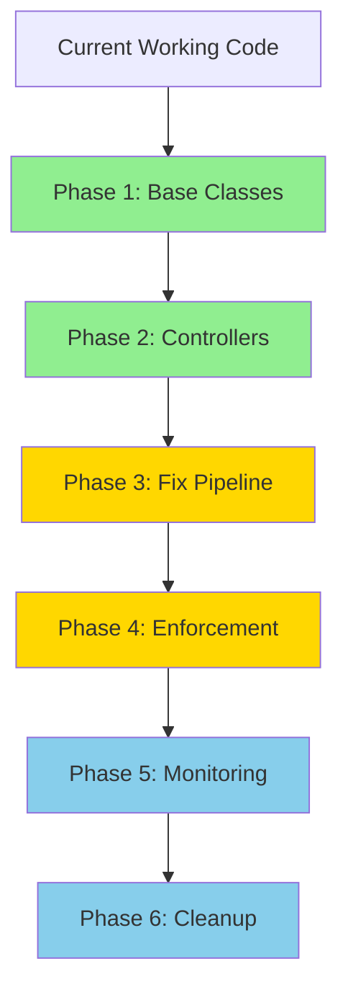

# 🎆 Job-Task Architecture Implementation Plan 🎆

## 🚀 IMPLEMENTATION PROGRESS
- **Phase 1**: ✅ **COMPLETE AND VERIFIED** (January 25, 2025) 🎉
- **Phase 2**: 🚧 **IN PROGRESS - CONTAINER CONTROLLER DEPLOYED** (August 25, 2025)
- **Phase 3**: ⏳ PENDING  
- **Phase 4**: ⏳ PENDING
- **Phase 5**: ⏳ PENDING

## 🎯 CURRENT PRIORITY (August 25, 2025)
**Focus: Complete STACController as next production controller**

### Completed:
1. ✅ **ContainerController** - DEPLOYED - list_container and sync_container operations working
2. ✅ **Orchestrator Pattern** - DEPLOYED - Sequential task execution for sync_container
3. ✅ **Fixed Issues** - Resolved task_id vs job_id parameter mismatch

### Next Priority:
1. **STACController** - Implement catalog_file operation (simple 1:1 pattern)
2. **RasterController** - Phase 3 priority for COG operations
3. **TiledRasterController** - Phase 3 for tiling operations

### 🏆 Phase 1 Accomplishments (FULLY OPERATIONAL):
✅ BaseJobController with enforced Job→Task pattern
✅ ControllerFactory for operation routing
✅ HelloWorldController as proof of concept
✅ TaskManager with deterministic IDs AND job completion detection
✅ Enhanced JobRepository and TaskRepository with proper metadata handling
✅ Task queuing to geospatial-tasks queue
✅ JSON-based ID generation (no colons!)
✅ All files in root directory as required
✅ **Jobs properly transition to COMPLETED status** 🎉
✅ **Tasks process successfully without poison queue failures** 🎉
✅ **Comprehensive logging with visual indicators** 🎉
✅ **End-to-end flow verified with multiple test runs** 🎉

### 🐛 Issues Resolved During Phase 1:
- Fixed TaskRepository.update_task_status() to accept metadata dict
- Added missing check_and_update_job_status() method to TaskManager
- Fixed task queue trigger to properly detect Job→Task architecture tasks
- Enhanced logging throughout the pipeline for complete visibility
- Resolved deployment caching issues with force deployment

## ⚠️ CRITICAL REQUIREMENT: NO FOLDERS
**ALL Python files MUST be in the root directory. DO NOT create any subdirectories like /controllers/, /services/, /managers/. This is EXTREMELY IMPORTANT for Azure Functions deployment.**

## Overview
Transform the existing codebase to enforce strict Job→Task separation pattern while maintaining all current functionality. This plan can be implemented by any Claude instance with access to the codebase. All new files will be created in the root directory alongside existing files.

## Current State Assessment

### Working Components (DO NOT BREAK)
- ✅ Managed identity authentication with user delegation SAS
- ✅ Queue-based processing (geospatial-jobs, geospatial-tasks)
- ✅ Job tracking in Azure Table Storage
- ✅ STAC cataloging with PostGIS
- ✅ Container listing with blob inventory
- ✅ Poison queue monitoring
- ✅ Basic COG conversion pipeline

### Problems to Solve
- ❌ Inconsistent job vs task usage (some operations bypass tasks)
- ❌ Tiled raster tasks failing (need windowed reading fixes)
- ❌ Jobs stuck in PROCESSING state when tasks complete
- ❌ No enforced pattern for job→task relationship
- ❌ Direct service calls without task context

## File Organization (ALL IN ROOT DIRECTORY)

⚠️ **CRITICAL: NO FOLDERS - All files must be in root directory for Azure Functions**

New files to be created (all in root):
```
rmhgeoapi/
├── base_controller.py (new)
├── controller_exceptions.py (new)
├── base_task_service.py (new)
├── service_decorators.py (new)
├── task_manager.py (new)
├── container_controller.py (new)
├── database_controller.py (new)
├── stac_controller.py (new)
├── raster_controller.py (new)
├── controller_factory.py (new)
├── job_completion_manager.py (new)
├── telemetry_metrics.py (new)
└── [all existing files remain in root]
```

**NO GITHUB COMMITS** - User will handle all version control

## Implementation Phases

---

## Phase 1: Create Base Classes and Interfaces ✅ COMPLETE 🎆
**Status**: Successfully deployed to production on January 24, 2025
**Verified**: Fully operational and tested on January 25, 2025
**Goal**: Establish the architectural foundation without breaking existing code

### 🎉 CELEBRATION TIME! 🎉
```
    🎆 🎇 ✨ 🎆 🎇 ✨ 🎆 🎇 ✨
    
    PHASE 1 IS COMPLETE AND WORKING!
    
    Jobs → Tasks → Services → Success!
    
    🚀 HelloWorld flies high! 🚀
    📊 Jobs complete properly! 📊
    ✅ No poison queue fails! ✅
    
    🎆 🎇 ✨ 🎆 🎇 ✨ 🎆 🎇 ✨
```

### 1.1 Create Base Controllers ✅ COMPLETE
```python
# File: base_controller.py (NEW - IN ROOT DIRECTORY)
"""
Create BaseJobController abstract class with:
- validate_request() 
- create_tasks() - MUST create at least one task
- aggregate_results()
- process_job() - standard flow implementation
"""

# File: controller_exceptions.py (NEW - IN ROOT DIRECTORY)
"""
Define controller-specific exceptions:
- InvalidRequestError
- TaskCreationError
- JobProcessingError
"""
```

### 1.2 Update Service Base Classes ✅ COMPLETE
```python
# File: base_task_service.py (NEW - IN ROOT DIRECTORY)
"""
Create BaseTaskService abstract class:
- Inherits from existing BaseProcessingService
- Adds validate_inputs(), validate_outputs()
- Adds execute_task() standard flow
- Add @requires_task decorator
"""

# File: service_decorators.py (NEW - IN ROOT DIRECTORY)
"""
Create @requires_task decorator that:
- Checks for task_id in kwargs
- Raises error if missing
- Can be disabled with environment variable for testing
"""
```

### 1.3 Create Task Manager ✅ COMPLETE
```python
# File: task_manager.py (NEW - IN ROOT DIRECTORY)
"""
Centralized task management:
- Generate task IDs deterministically
- Track task lineage (parent job)
- Handle task state transitions
- Coordinate with TaskRepository
"""
```

### Testing Checklist for Phase 1:
- [ ] Base classes can be imported without errors
- [ ] Existing code still runs unchanged
- [ ] No breaking changes to current functionality

---

## Phase 2: Implement Controllers for Existing Operations 🚧 ACTIVE
**Goal**: Wrap existing services in controllers without modifying services yet
**Status**: IN PROGRESS - August 24, 2025

### 2.1 Priority Controllers (IMPLEMENT FIRST)
```python
# File: container_controller.py (NEW - IN ROOT DIRECTORY) 🎯 PRIORITY 1
"""
ContainerController - First production controller to implement
Handles both list_container and initial sync_container operations

Operations:
1. list_container: Single task pattern (1 job → 1 task)
   - Simple operation that lists files and stores inventory
   - No fan-out needed
   
2. sync_container inventory: Creates orchestrator task
   - Will fan out to create catalog tasks
"""

# File: stac_controller.py (NEW - IN ROOT DIRECTORY) 🎯 PRIORITY 2  
"""
STACController - Demonstrates fan-out pattern
Handles catalog_file and full sync_container orchestration

Operations:
1. catalog_file: Single task pattern (1 job → 1 task)
   - Catalogs individual file to STAC
   
2. sync_container: Fan-out pattern (1 job → N tasks)
   - Already has task creation logic in SyncContainerService
   - Perfect example of parallel task creation
   - Creates one catalog_file task per geospatial file
"""

# File: database_controller.py (NEW - IN ROOT DIRECTORY) - Lower Priority
"""
DatabaseHealthController:
- Wraps DatabaseHealthService
- Single task pattern
- Can be implemented after priority controllers
"""
```

### 2.2 Raster Processing Controllers
```python
# File: raster_controller.py (NEW - IN ROOT DIRECTORY)
"""
Create three controllers:

1. SimpleCOGController:
   - Single file → single task
   - Wraps existing COG conversion

2. TiledRasterController:
   - Fix existing TiledRasterProcessor issues
   - Ensure proper task creation for each tile
   - Add proper job status updates

3. ValidationController:
   - Raster validation as single task
"""
```

### 2.3 Update ServiceFactory
```python
# File: services.py (MODIFY - EXISTING FILE IN ROOT)
"""
Update ServiceFactory.get_service():
- Add deprecation warning for direct service calls
- Log when services called without task context
- Prepare for Phase 3 enforcement
"""
```

### Testing Checklist for Phase 2:
- [ ] All existing operations have controllers
- [ ] Controllers create appropriate tasks
- [ ] Job→Task relationships properly tracked
- [ ] No change to external API behavior

---

## Phase 3: Fix Task Processing Pipeline (Day 4-5)
**Goal**: Ensure tasks properly update job status and fix stuck jobs

### 3.1 Fix Job Status Updates
```python
# File: repositories.py (MODIFY - EXISTING FILE IN ROOT)
"""
Add to JobRepository:
- update_job_metadata() - for storing task counts
- get_job_with_tasks() - fetch job and related tasks
- check_job_completion() - determine if all tasks done
"""

# File: job_completion_manager.py (NEW - IN ROOT DIRECTORY)
"""
JobCompletionManager:
- Monitor task completions
- Update job status when all tasks complete
- Handle partial failures (completed_with_errors)
- Prevent jobs stuck in PROCESSING
"""
```

### 3.2 Fix Task Status Tracking
```python
# File: repositories.py (MODIFY - EXISTING FILE IN ROOT)
"""
Update TaskRepository:
- Ensure update_task_status() properly updates timestamps
- Add get_tasks_for_job() if missing
- Add bulk_update_status() for efficiency
"""

# File: function_app.py (MODIFY - EXISTING FILE IN ROOT)
"""
Update process_task_queue():
- After task completion, check if job should complete
- Call JobCompletionManager.check_and_update_job()
- Ensure proper error handling
"""
```

### 3.3 Fix Tiled Raster Processing
```python
# File: tiled_raster_processor.py (MODIFY - EXISTING FILE IN ROOT)
"""
Fix the existing issues:
- Ensure tasks are properly created in Table Storage
- Fix task_id generation (deterministic)
- Ensure proper status updates
- Add logging for debugging
"""

# File: raster_reprojector.py (ALREADY FIXED - EXISTING FILE IN ROOT)
"""
Verify windowed reading is working:
- Check src_window parameter usage
- Verify GDAL environment variables set
- Ensure memory-efficient processing
"""
```

### Testing Checklist for Phase 3:
- [ ] Jobs transition to COMPLETED when all tasks finish
- [ ] Tiled raster processing creates correct number of tasks
- [ ] Task failures properly reflected in job status
- [ ] No more stuck jobs in PROCESSING state

---

## Phase 4: Enforce Job-Task Pattern (Day 6-7)
**Goal**: Make it impossible to bypass the job→task pattern

### 4.1 Update Function App Entry Points
```python
# File: function_app.py (MODIFY - EXISTING FILE IN ROOT)
"""
Update process_job_http():
- Route to controllers instead of services
- Refuse direct service operations
- Return error for legacy operation types

Update process_job_queue():
- Only accept job-level operations
- Create tasks via controllers
- Remove direct service calls

Update process_task_queue():
- Only process tasks (not jobs)
- Verify task exists in Table Storage
- Call service with task context
"""
```

### 4.2 Create Controller Factory
```python
# File: controller_factory.py (NEW - IN ROOT DIRECTORY)
"""
ControllerFactory (similar to ServiceFactory):
- get_controller(operation_type)
- Maps operation types to controllers
- Handles legacy operation migration
"""
```

### 4.3 Add Enforcement
```python
# File: services.py (MODIFY - EXISTING FILE IN ROOT)
"""
Update all services:
- Add @requires_task to process methods
- Remove ability to call without task_id
- Update method signatures to require task_id
"""
```

### Testing Checklist for Phase 4:
- [ ] Cannot call services directly without task
- [ ] All operations go through controllers
- [ ] Legacy operations properly migrated
- [ ] Error messages guide users to correct pattern

---

## Phase 5: Add Monitoring and Observability (Day 8)
**Goal**: Make the job→task hierarchy visible and debuggable

### 5.1 Enhanced Status Endpoints
```python
# File: function_app.py (MODIFY - EXISTING FILE IN ROOT)
"""
Update get_job_status():
- Include task breakdown (5 total, 3 complete, 1 failed, 1 pending)
- Show task hierarchy visualization
- Include timing information
"""

# File: models.py (MODIFY - EXISTING FILE IN ROOT)
"""
Enhance JobStatus:
- Add task_summary field
- Add progress_percentage
- Add estimated_completion
"""
```

### 5.2 Add Telemetry
```python
# File: telemetry_metrics.py (NEW - IN ROOT DIRECTORY)
"""
Track key metrics:
- Jobs created per operation type
- Tasks per job distribution
- Task execution time percentiles
- Queue depth over time
- Success/failure rates by operation
"""
```

### 5.3 Create Debug Endpoints
```python
# File: function_app.py (ADD TO EXISTING FILE IN ROOT)
"""
Add debug endpoints (with auth):
- GET /api/debug/job/{job_id}/tasks - list all tasks for job
- GET /api/debug/task/{task_id} - detailed task info
- GET /api/debug/stuck-jobs - find stuck jobs
- POST /api/debug/retry-task/{task_id} - retry failed task
"""
```

### Testing Checklist for Phase 5:
- [ ] Job status shows task breakdown
- [ ] Can trace job→task relationships
- [ ] Metrics being collected
- [ ] Debug endpoints working

---

## Phase 6: Migration and Cleanup (Day 9-10)
**Goal**: Remove old code and complete migration

### 6.1 Remove Direct Service Calls
```python
# Files to update:
- sync_container_service.py - use controller pattern
- stac_catalog_service.py - ensure task context
- raster_processor.py - remove direct orchestration
```

### 6.2 Update Documentation
```python
# Files to update:
- README.md - document job→task pattern
- CLAUDE.md - add controller examples
- API documentation - update operation descriptions
```

### 6.3 Clean Up State Management
```python
# Evaluate and decide:
- Keep or remove state_integration.py?
- Merge with new task management?
- Simplify if redundant with controllers
```

---

## Implementation Order and Dependencies



**Legend:**
- 🟢 Green: Non-breaking additions
- 🟡 Yellow: Fix existing issues
- 🔵 Blue: Enhancement and cleanup

---

## Testing Strategy

### Unit Tests to Add
```python
# tests/test_controllers.py (NEW)
- Test controller request validation
- Test task creation logic
- Test result aggregation

# tests/test_job_task_relationship.py (NEW)
- Test job creates correct tasks
- Test task updates affect job
- Test completion detection

# tests/test_enforcement.py (NEW)
- Test @requires_task decorator
- Test direct service call prevention
- Test controller routing
```

### Integration Tests
```python
# tests/integration/test_full_pipeline.py (NEW)
- Submit job via HTTP
- Verify tasks created
- Process tasks
- Verify job completes
```

### Manual Testing Script
```bash
# test_job_task_pattern.sh (NEW)
#!/bin/bash

# Test single file COG
echo "Testing single file COG conversion..."
curl -X POST .../api/jobs/cog_conversion ...
# Verify: 1 job, 1 task created

# Test container sync  
echo "Testing container sync..."
curl -X POST .../api/jobs/sync_container ...
# Verify: 1 job, N tasks (one per file)

# Test tiled raster
echo "Testing tiled raster..."
curl -X POST .../api/jobs/process_tiled_raster ...
# Verify: 1 job, M tasks (one per tile)
```

---

## Rollback Plan

If issues arise during implementation:

1. **Phase 1-2 Rollback**: Simply don't use controllers, existing code unchanged
2. **Phase 3 Rollback**: Revert function_app.py changes, keep improvements
3. **Phase 4 Rollback**: Disable @requires_task decorator via environment variable
4. **Phase 5 Rollback**: Remove new endpoints, keep core functionality
5. **Phase 6 Rollback**: Restore removed code from git history

---

## Success Criteria

### Phase 1-2 Success
- [ ] Controllers created for all operations
- [ ] No breaking changes to existing API
- [ ] All current tests still pass

### Phase 3 Success  
- [ ] Jobs properly transition to COMPLETED
- [ ] Tiled raster processing works
- [ ] No stuck jobs in PROCESSING state

### Phase 4 Success
- [ ] Job→Task pattern enforced
- [ ] Clear error messages for violations
- [ ] Migration path for legacy code

### Phase 5 Success
- [ ] Full visibility into job→task hierarchy
- [ ] Debugging tools available
- [ ] Metrics being collected

### Phase 6 Success
- [ ] Old code removed
- [ ] Documentation updated
- [ ] Clean, maintainable codebase

---

## Notes for Implementing Claude

### ⚠️ CRITICAL REQUIREMENTS
1. **NO FOLDERS** - ALL Python files MUST be in the root directory
2. **NO GITHUB COMMITS** - Do not use git commands, user will handle commits
3. **PRESERVE AZURE FUNCTIONS STRUCTURE** - Flat file structure is required for deployment

### Key Files to Understand First
1. `function_app.py` - Entry points and queue handlers
2. `services.py` - Service base class and factory
3. `repositories.py` - JobRepository and TaskRepository
4. `tiled_raster_processor.py` - Example of current issues

### Common Pitfalls to Avoid
1. Don't break managed identity authentication
2. Keep job ID generation deterministic (SHA256)
3. Maintain backwards compatibility during migration
4. Test with actual Azure resources (not just locally)
5. Preserve STAC cataloging functionality
6. **DO NOT CREATE SUBDIRECTORIES** - Azure Functions requires flat structure
7. **DO NOT MAKE GIT COMMITS** - User will handle version control

### Environment Variables Needed
```bash
STORAGE_ACCOUNT_NAME=rmhazuregeo
ENABLE_TASK_ENFORCEMENT=false  # Set true in Phase 4
DEBUG_ENDPOINTS_ENABLED=false  # Set true for debugging
```

### Resources
- Current CLAUDE.md has all Azure resource details
- JOB_TASK_ARCHITECTURE.md has design patterns
- Existing tests in tests/ directory show expected behavior

---

## Timeline

**Total: 10 days with single developer**

- Days 1-3: Non-breaking additions (Phases 1-2)
- Days 4-5: Fix existing issues (Phase 3)  
- Days 6-7: Enforce new pattern (Phase 4)
- Days 8: Add monitoring (Phase 5)
- Days 9-10: Cleanup and documentation (Phase 6)

**Checkpoint Days**: 3, 5, 7, 10

This plan allows for incremental implementation with validation at each phase.