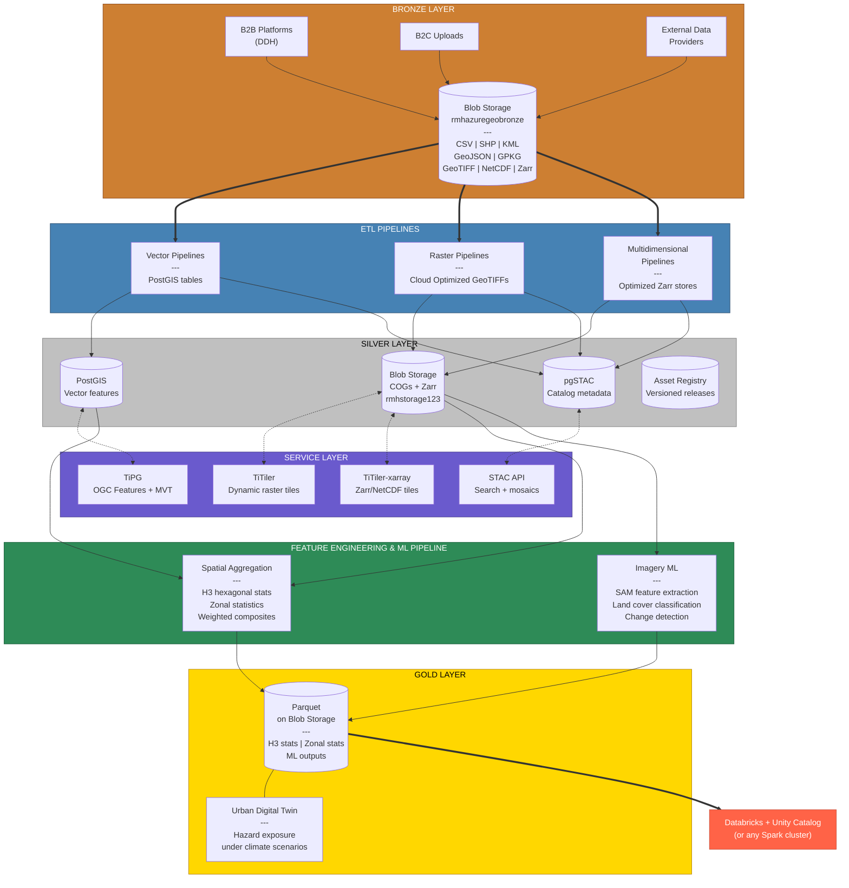

# Geospatial Platform — Architecture Overview

**Date**: 17 MAR 2026
**Purpose**: Presentation material — infographics, slides, stakeholder communication
**Audience**: Colleagues, management, technical peers

---

## Platform Summary

A medallion-architecture geospatial platform that ingests raw spatial data from B2B/B2C sources, transforms it into analysis-ready formats, serves it as REST APIs, and produces decision-ready analytics through feature engineering and ML pipelines.

Single codebase. Single database. No external messaging infrastructure.

---

## Architecture — The Medallion



### Diagram Key

| Color | Layer | Role |
|-------|-------|------|
| Bronze | Bronze Layer | Raw data intake — airgapped from downstream |
| Steel blue | ETL Pipelines | Transform and validate — the only bridge from Bronze to Silver |
| Silver | Silver Layer | Authoritative analysis-ready data |
| Purple | Service Layer | REST APIs — serves Silver data without duplication |
| Green | Feature Engineering & ML | Aggregation + ML inference — Silver to Gold |
| Gold | Gold Layer | Decision-ready Parquet analytics |
| Red | Analytics Integration | Databricks / Spark — platform-agnostic consumer |

Solid arrows = data flow. Dotted arrows = serving relationship (no data copy). Thick arrows = layer boundaries.

---

## Bronze Layer — The Intake Zone

**Storage**: `rmhazuregeobronze` (Azure Blob Storage)

Raw data from connected applications and end users. No schema enforcement, no format requirements. Intentionally airgapped from downstream layers — source data is never modified, always recoverable.

| Aspect | Detail |
|--------|--------|
| **Who writes** | B2B platforms (DDH), B2C uploads, external data providers |
| **Formats accepted** | CSV, SHP, KML, GeoJSON, GPKG, GeoTIFF, NetCDF, Zarr — whatever they have |
| **Access control** | Connected apps can write; only ETL pipelines can read |
| **Retention** | Source data preserved indefinitely |
| **Key property** | Airgapped — no direct connection to Silver or Gold |

**Why the airgap matters**: Bronze is untrusted input. The ETL pipelines are the only path from Bronze to Silver. This means every piece of data in Silver has been validated, transformed, and cataloged — no raw data leaks into production APIs.

---

## ETL Pipelines — Bronze to Silver

Three pipeline families connect Bronze to Silver. Each validates, transforms, and catalogs data into analysis-ready formats.

### Vector Pipelines

| Pipeline | Input | Output |
|----------|-------|--------|
| Single file ingest | CSV, SHP, KML, GeoJSON, GPKG | PostGIS table + OGC Features API endpoint |
| Multi-source ingest | N files → N tables | Multiple PostGIS tables from one submission |
| Split views | Single file + split column | 1 PostGIS table + N filtered views |
| Unpublish | — | Drops table, removes metadata, preserves blobs |

**Processing**: Format detection → CRS validation/reprojection → geometry cleaning (null removal, make_valid, 2D normalization, antimeridian fix, winding order) → PostGIS load → catalog registration → TiPG refresh.

### Raster Pipelines

| Pipeline | Input | Output |
|----------|-------|--------|
| Standard COG | GeoTIFF ≤1GB | Single Cloud Optimized GeoTIFF + STAC item |
| Tiled COGs | GeoTIFF >1GB | N tiled COGs + STAC collection with N searchable items |
| FATHOM flood | Multi-band flood data | Merged COGs per scenario/return period |
| Unpublish | — | Deletes blobs, removes STAC + metadata |

**Processing**: Download → validate (CRS, bands, format) → conditional routing (single vs tiled) → COG creation (windowed reads for memory safety) → upload to Silver storage → STAC registration.

### Multidimensional Pipelines

| Pipeline | Input | Output |
|----------|-------|--------|
| Native Zarr ingest | Zarr store | Optimized Zarr (256×256 spatial, time=1, Blosc+LZ4) |
| NetCDF-to-Zarr | NetCDF files | Native Zarr store with optimized chunking |
| VirtualiZarr | NetCDF files | Virtual Zarr references (metadata only, no data copy) |
| Unpublish | — | Deletes blobs, removes STAC + metadata |

**Processing**: Validate store structure → copy blobs (fan-out, batched ~500MB per task) or rechunk → consolidate metadata → STAC registration.

---

## Silver Layer — Authoritative Analysis-Ready Data

**Storage**: `rmhstorage123` (COGs, Zarr) + PostgreSQL/PostGIS (vector, catalog)

The Silver Layer contains validated, transformed, and cataloged data. Every item is deterministically derived from Bronze — given the same source data and parameters, the Silver output is identical. Silver is a materialized view of Bronze.

| Data Type | Format | Location |
|-----------|--------|----------|
| Vector features | PostGIS tables | `geo` schema on PostgreSQL |
| Raster imagery | Cloud Optimized GeoTIFFs | `rmhstorage123` blob storage |
| Multidimensional | Optimized Zarr stores | `rmhstorage123` blob storage |
| Catalog metadata | pgSTAC items + collections | `pgstac` schema on PostgreSQL |
| Asset registry | Assets + versioned releases | `app` schema on PostgreSQL |

### Key Properties

- **Deterministically derived**: Re-run the ETL from Bronze → get identical Silver output
- **Version-controlled**: Assets have versioned releases with ordinal naming (ord1, ord2, ord3)
- **Approval-gated**: Data is cataloged at ingest but only published to STAC after human approval
- **Unpublishable**: Every forward pipeline has a paired unpublish pipeline that cleanly reverses it

---

## Service Layer — Making Silver Accessible

**Application**: `rmhtitiler` (containerized FastAPI on Azure App Service)

The Service Layer sits orthogonal to Silver — it doesn't store data, it serves Silver data as REST APIs. No data duplication between storage and serving.

| Service | Technology | What It Serves | Endpoint Pattern |
|---------|-----------|----------------|-----------------|
| **Dynamic raster tiles** | TiTiler + rio-tiler | COGs from blob storage | `/cog/tiles/{z}/{x}/{y}` |
| **STAC catalog search** | titiler-pgstac | pgSTAC items + mosaic searches | `/stac/search`, `/searches/register` |
| **Multidimensional tiles** | titiler.xarray | Zarr/NetCDF data | `/xarray/tiles/...` |
| **Vector features (GeoJSON)** | TiPG + PostGIS | PostGIS tables as OGC Features | `/vector/collections/{id}/items` |
| **Vector tiles (MVT)** | TiPG + PostGIS | PostGIS tables as Mapbox Vector Tiles | `/vector/collections/{id}/tiles/{z}/{x}/{y}` |
| **H3 analytics** | DuckDB server-side | Gold Layer Parquet queries | `/h3/query` |
| **Health + diagnostics** | Custom | Platform operational status | `/health`, `/readyz` |

### Key Properties

- Single Docker container with Azure Managed Identity authentication
- On-the-fly rendering — no pre-generated tile caches
- Shared PostgreSQL with the ETL platform (pgSTAC, PostGIS)
- OAuth-authenticated blob access (COGs served via `/vsiaz/` with managed identity tokens)

---

## Feature Engineering & ML Pipeline — Silver to Gold

**Status**: Future development — architecture designed, not yet implemented

Two workload categories that transform Silver analysis-ready data into Gold decision-ready analytics.

### Spatial Aggregation (Feature Engineering)

Aggregate Silver spatial data to standardized geometries, producing Parquet files queryable by DuckDB or any Spark-compatible engine.

| Workload | Silver Input | Gold Output |
|----------|-------------|-------------|
| H3 hexagonal zonal stats | Rasters (DEM, flood, land cover) | Per-hexagon statistics at resolutions 3-7 |
| Zonal statistics by boundaries | Rasters + versioned admin polygons (OCHA, GADM) | Per-zone stats (mean, sum, median, stdev) |
| Vector spatial aggregation | PostGIS tables, Overture Maps GeoParquet | Point counts, line lengths, polygon areas per H3 cell |
| Weighted composite scores | Multiple Gold Parquets | Multi-source risk/exposure indices |

### Imagery ML (Urban Digital Twin)

Foundation model inference on Silver raster imagery to extract physical features of the built environment.

| Workload | Silver Input | Gold Output |
|----------|-------------|-------------|
| Urban feature extraction | Satellite imagery (COGs) | Building footprints, roads, infrastructure (Parquet) |
| Land cover classification | Satellite/aerial imagery | Per-pixel or per-polygon land use categories |
| Change detection | Multi-temporal imagery | Feature change polygons with timestamps |
| Climate scenario overlay | CMIP6 projections + extracted features | Exposure metrics under different scenarios |

### The Urban Digital Twin

SAM and similar foundation models extract what's physically there (buildings, infrastructure, land use). Climate scenario data models what happens to it under different futures. Combined, this produces a digital representation of the built environment with simulated hazard exposure — an Urban Digital Twin that quantifies human physical exposure to natural hazards and how it changes across climate scenarios.

### Gold Layer Output

**Format**: Apache Parquet on blob storage — platform-agnostic, queryable by any engine.

```
Gold Layer (Parquet on blob storage)
    │
    ├── H3 aggregations:     h3_stats/source={id}/period={p}/resolution={r}.parquet
    ├── Zonal statistics:    zonal_stats/raster={id}/boundary={id}/version={v}/all.parquet
    ├── ML outputs:          features/model={id}/region={r}/extraction.parquet
    │
    └── Integration point:   Unity Catalog / Databricks (or any Spark cluster)
```

The Gold Layer is an open interface. Our organization uses Databricks + Unity Catalog, but the architecture is platform-agnostic — any Spark cluster, DuckDB instance, Snowflake external tables, or BigQuery can query the same Parquet files.

---

## Orchestration — How Work Gets Done

### Three Applications

| App | Role | Runtime | Responsibility |
|-----|------|---------|---------------|
| **Gateway** | B2B Front Door | Azure Function App | Request validation, asset/release management, writes work orders to DB |
| **Orchestrator** | Brain | Docker (lightweight) | DAG evaluation, task promotion, fan-out expansion, completion detection |
| **Workers** (×N) | Muscles | Docker (GDAL, geopandas, xarray) | Claims tasks, executes handlers, writes results |

### Coordination Mechanism

PostgreSQL is the single coordination mechanism. No message queues, no AMQP, no Service Bus.

- **Gateway** writes a workflow submission → `INSERT INTO workflow_runs`
- **Orchestrator** polls for state changes → promotes tasks from `pending` to `ready`
- **Workers** compete for tasks → `SELECT FOR UPDATE SKIP LOCKED`
- **Horizontal scaling**: Add more Docker workers → same code, PostgreSQL distributes work

### DAG Workflows (YAML-Defined)

Workflows are YAML files that compose atomic handlers into directed acyclic graphs. The handler library is a menu of operations; workflows are recipes.

Four node types:

| Node Type | What It Does | Executed By |
|-----------|-------------|-------------|
| **task** | Runs a handler on a worker | Worker (SKIP LOCKED claim) |
| **conditional** | Evaluates condition, routes to one branch | Orchestrator (inline) |
| **fan_out** | Expands array into N parallel child tasks | Orchestrator (creates N task rows) |
| **fan_in** | Waits for all fan-out children, aggregates results | Orchestrator (inline) |

Example — raster pipeline with conditional routing:

```
download → validate → route_by_size ─┬─ standard (≤1GB) ─→ create_cog → upload → register_stac ─┐
                                      │                                                            │
                                      └─ large (>1GB) ─→ tile (fan_out) → aggregate (fan_in)      │
                                                              → register_tiled_stac ───────────────┤
                                                                                                   │
                                                                                        persist_metadata
```

### Key Orchestration Properties

- **Idempotent job IDs**: `SHA256(job_type + params)` — submit the same job twice, get the same ID
- **Deterministic paths**: Every intermediate file path is derivable from `run_id` + `node_name`
- **Approval-gated publication**: STAC items cached during processing, written to catalog only after human approval
- **Paired workflows**: Every forward pipeline (ingest) has a reverse pipeline (unpublish)
- **Atomic fan-out**: 100 parallel tasks created in one database transaction (crash-safe)

---

## Design Principles

| Principle | What It Means |
|-----------|--------------|
| **Everything is a deterministic materialized view** | Same inputs + same parameters = identical outputs. Silver is derived from Bronze. Gold is derived from Silver. Blow it away, re-run, get the same result. |
| **Infrastructure as code** | One codebase, one repo. `APP_MODE` selects the role (gateway, orchestrator, worker). Same code deploys as Function App or Docker. |
| **The database is the queue** | PostgreSQL `SKIP LOCKED` replaces Service Bus. Workers compete for tasks atomically. Queryable state — "show me all running tasks" is a SELECT. |
| **Airgapped intake** | Bronze is intentionally separated from Silver/Gold. ETL pipelines are the only bridge. No raw data leaks into production APIs. |
| **Fail fast, never fall back** | Explicit errors, not silent defaults. If a field is missing, raise an error — never guess. |
| **Approval-gated publication** | Data is processed and cataloged but not visible until a human approves the release. Revoke removes visibility. |
| **Platform-agnostic outputs** | Gold Layer is Parquet on blob storage. Any Spark cluster, DuckDB, or analytics engine can read it. No vendor lock-in. |
| **Paired lifecycles** | Every ingest pipeline has a matching unpublish pipeline. Nothing gets created without a known path to remove it. |

---

## Infrastructure

| Resource | Purpose |
|----------|---------|
| **PostgreSQL** (`rmhpostgres`) | PostGIS, pgSTAC, app schema, workflow orchestration — single database for everything |
| **Bronze Storage** (`rmhazuregeobronze`) | Raw file intake from B2B/B2C sources |
| **Silver Storage** (`rmhstorage123`) | COGs, Zarr stores — analysis-ready outputs |
| **Gold Storage** | Parquet files — decision-ready analytics (future) |
| **Container Registry** (`rmhazureacr`) | Docker images for workers, orchestrator, TiTiler |
| **App Service** (`rmhtitiler`) | Service Layer — TiTiler, TiPG, STAC, H3 |
| **Function Apps** | Gateway (`rmhgeogateway`), Orchestrator (`rmhazuregeoapi`) |

---

## Current State & Roadmap

| Layer | Status |
|-------|--------|
| **Bronze Layer** | Production — active B2B file intake |
| **ETL Pipelines** | Production — 14 pipeline types across vector, raster, multidimensional |
| **Silver Layer** | Production — PostGIS, COGs, Zarr, pgSTAC catalog |
| **Service Layer** | Production — TiTiler, TiPG, STAC API, H3 Explorer |
| **DAG Orchestration** | In progress — migrating from Service Bus to PostgreSQL-based DAG (v0.10→v0.12) |
| **Feature Engineering & ML Pipeline** | Designed — H3 aggregation, zonal stats, SAM extraction |
| **Gold Layer** | Designed — Parquet output layout, Databricks integration point |
| **Urban Digital Twin** | Conceptual — hazard exposure modeling under climate scenarios |
