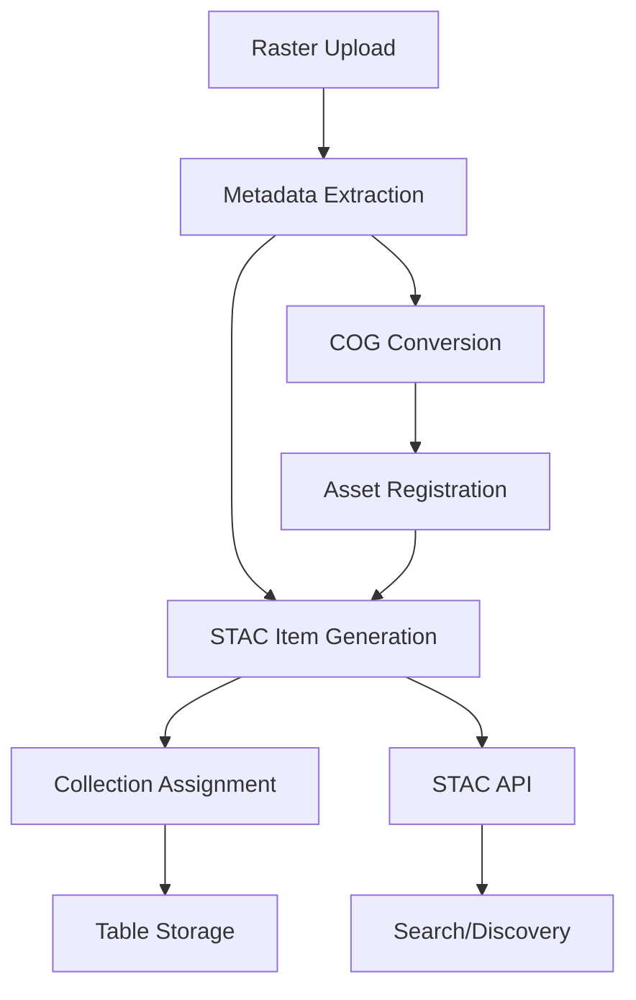

# STAC Integration Plan for Azure Geospatial ETL Pipeline

## What is STAC?

**STAC (SpatioTemporal Asset Catalog)** is a specification that provides a common language to describe geospatial information, making it easier to search, discover, and use geospatial data across platforms.

### Core STAC Components:
1. **Item** - A GeoJSON Feature representing a single spatiotemporal asset
2. **Collection** - Groups of related Items with shared properties
3. **Catalog** - Top-level object linking to Collections and Items
4. **Asset** - Links to the actual data files (COGs, metadata, thumbnails)

---

## Required Fields for STAC Item Creation

### Mandatory Fields (STAC Spec v1.0.0):

| Field | Type | Description | Source in Our Pipeline |
|-------|------|-------------|----------------------|
| `id` | string | Unique identifier | SHA256 hash or filename |
| `type` | string | Always "Feature" | Static value |
| `stac_version` | string | STAC version (1.0.0) | Static value |
| `geometry` | object | GeoJSON geometry | From raster bounds |
| `bbox` | array | Bounding box [west, south, east, north] | From metadata extraction |
| `properties` | object | Item properties including datetime | From metadata + custom |
| `assets` | object | Links to data files | Blob storage URLs |
| `links` | array | Related resources | Collection, self, parent |
| `collection` | string | Collection ID | Dataset ID or custom |

### Key Properties Fields:

| Property | Type | Required | Source |
|----------|------|----------|--------|
| `datetime` | string | Yes | EXIF/TIFF tags or file modified |
| `created` | string | No | File creation time |
| `updated` | string | No | Processing timestamp |
| `title` | string | No | Filename or custom |
| `description` | string | No | Generated from metadata |
| `instruments` | array | No | From EXIF (camera model) |
| `platform` | string | No | From EXIF (make) |
| `gsd` | number | No | Pixel size in meters |
| `eo:bands` | array | No | Band information |
| `proj:epsg` | integer | No | CRS EPSG code |
| `proj:transform` | array | No | Affine transformation |

---

## Current Data Available for STAC

Based on our metadata extraction service, we already have:

### ✅ **Available Now:**
- **Geometry & Bounds**: Full spatial extent in native and WGS84
- **CRS Information**: EPSG codes, WKT, PROJ4 strings
- **Transform**: Affine transformation matrix
- **Pixel Resolution**: Ground sample distance
- **Band Information**: Count, data types, descriptions
- **Temporal Data**: From EXIF DateTime or file timestamps
- **Checksums**: For data integrity
- **File Properties**: Size, format, compression
- **Platform/Sensor**: From EXIF (Make/Model)
- **Statistics**: Band min/max/mean for summaries

### ⚠️ **Need to Add/Derive:**
- **Collection Assignment**: Logic to group items
- **Asset URLs**: Public or SAS URLs for data access
- **Thumbnail Generation**: Preview images
- **Cloud Cover**: For optical imagery (if applicable)
- **Processing Level**: Raw/processed designation

---

## Integration Architecture



---

## Implementation Plan

### Phase 1: STAC Item Generation Service
```python
# New service: stac_generation_service.py

class STACGenerationService(BaseProcessingService):
    """Generate STAC Items from processed geospatial data"""
    
    def process(self, job_id, dataset_id, resource_id, version_id, operation_type):
        # 1. Extract comprehensive metadata
        metadata = self._extract_metadata(dataset_id, resource_id)
        
        # 2. Create STAC Item
        stac_item = self._create_stac_item(metadata, dataset_id, resource_id)
        
        # 3. Generate assets (COG, thumbnail, metadata)
        assets = self._generate_assets(dataset_id, resource_id)
        
        # 4. Assign to collection
        collection = self._get_or_create_collection(dataset_id)
        
        # 5. Store in Table Storage
        self._store_stac_item(stac_item, collection)
        
        return stac_item.to_stac_dict()
```

### Phase 2: Modify ETL Pipeline

#### Option A: Automatic STAC Generation (Recommended)
```python
# In function_app.py - Queue trigger

def process_geospatial_job(msg: func.QueueMessage):
    # Existing processing...
    
    # After successful processing, automatically generate STAC
    if job_data['operation_type'] in ['cog_conversion', 'metadata_extraction']:
        # Trigger STAC generation
        stac_job = {
            'operation_type': 'stac_generation',
            'dataset_id': job_data['dataset_id'],
            'resource_id': output_filename,  # Use processed file
            'parent_job': job_data['job_id']
        }
        queue_client.send_message(json.dumps(stac_job))
```

#### Option B: Explicit STAC Operation
```python
# New endpoint: POST /api/jobs/stac_generation
# User explicitly requests STAC generation after processing
```

### Phase 3: STAC Item Creation Logic

```python
def _create_stac_item(self, metadata: Dict, dataset_id: str, resource_id: str) -> STACItem:
    """Create STAC Item from metadata"""
    
    # 1. Generate unique ID
    item_id = hashlib.sha256(f"{dataset_id}:{resource_id}".encode()).hexdigest()[:16]
    
    # 2. Extract geometry from bounds
    bounds = metadata['raster']['bounds']['geographic']
    geometry = STACGeometry(
        type="Polygon",
        coordinates=[[
            [bounds['west'], bounds['south']],
            [bounds['east'], bounds['south']],
            [bounds['east'], bounds['north']],
            [bounds['west'], bounds['north']],
            [bounds['west'], bounds['south']]
        ]]
    )
    
    # 3. Create bounding box
    bbox = STACBoundingBox(
        west=bounds['west'],
        south=bounds['south'],
        east=bounds['east'],
        north=bounds['north']
    )
    
    # 4. Extract datetime
    datetime_str = self._extract_datetime(metadata)
    
    # 5. Build properties
    properties = {
        "title": resource_id,
        "description": f"Processed raster from {dataset_id}",
        
        # Projection Extension
        "proj:epsg": metadata['raster']['crs']['epsg'],
        "proj:transform": metadata['raster']['transform']['affine'],
        "proj:shape": [metadata['raster']['dimensions']['height'], 
                      metadata['raster']['dimensions']['width']],
        
        # Raster Extension
        "raster:bands": self._format_band_info(metadata),
        
        # EO Extension (if applicable)
        "gsd": metadata['raster']['transform']['pixel_size']['x'],
        
        # Processing info
        "processing:software": "Azure Geospatial ETL Pipeline v1.0",
        "processing:datetime": datetime.utcnow().isoformat(),
        
        # Checksums
        "checksum:sha256": metadata['checksums']['sha256'],
        "file:size": metadata['file_properties']['size_bytes']
    }
    
    # 6. Add platform info if available
    if 'exif' in metadata:
        properties["instruments"] = [metadata['exif'].get('Model', 'Unknown')]
        properties["platform"] = metadata['exif'].get('Make', 'Unknown')
    
    # 7. Create STAC Item
    item = STACItem(
        id=item_id,
        collection_id=dataset_id,
        geometry=geometry,
        bbox=bbox,
        datetime_str=datetime_str,
        properties=properties
    )
    
    return item
```

### Phase 4: Asset Generation

```python
def _generate_assets(self, dataset_id: str, resource_id: str) -> Dict[str, STACAsset]:
    """Generate STAC Assets with proper links"""
    
    assets = {}
    
    # 1. Main data asset (COG)
    cog_url = self._get_blob_url(Config.SILVER_CONTAINER_NAME, resource_id)
    assets["data"] = STACAsset(
        href=cog_url,
        title="Cloud Optimized GeoTIFF",
        description="Processed COG file",
        type="image/tiff; application=geotiff; profile=cloud-optimized",
        roles=["data", "cog"]
    )
    
    # 2. Thumbnail asset
    thumbnail_url = self._generate_thumbnail(dataset_id, resource_id)
    if thumbnail_url:
        assets["thumbnail"] = STACAsset(
            href=thumbnail_url,
            title="Thumbnail",
            description="Preview image",
            type="image/png",
            roles=["thumbnail"]
        )
    
    # 3. Metadata asset
    metadata_url = self._store_metadata_json(dataset_id, resource_id)
    assets["metadata"] = STACAsset(
        href=metadata_url,
        title="Extended Metadata",
        description="Complete metadata in JSON format",
        type="application/json",
        roles=["metadata"]
    )
    
    return assets
```

### Phase 5: Collection Management

```python
def _get_or_create_collection(self, dataset_id: str) -> STACCollection:
    """Get existing or create new STAC Collection"""
    
    # Check if collection exists
    existing = self.table_repo.get_entity('collections', dataset_id)
    
    if existing:
        return STACCollection.from_table_entity(existing)
    
    # Create new collection
    collection = STACCollection(
        id=dataset_id,
        title=f"Dataset: {dataset_id}",
        description=f"Geospatial data collection for {dataset_id}"
    )
    
    # Set collection metadata
    collection.keywords = ["raster", "cog", "azure", dataset_id]
    collection.license = "proprietary"
    
    # Add provider info
    collection.providers = [{
        "name": "Azure Geospatial ETL",
        "roles": ["processor", "host"],
        "url": "https://rmhgeoapiqfn.azurewebsites.net"
    }]
    
    # Store collection
    self.table_repo.upsert_entity(collection.to_table_entity())
    
    return collection
```

---

## Storage Schema

### Table Storage Design:

#### Collections Table
- **PartitionKey**: "collections"
- **RowKey**: collection_id
- **Fields**: All STAC Collection fields

#### Items Table
- **PartitionKey**: "{collection_id}_{spatial_index}"
- **RowKey**: item_id
- **Fields**: All STAC Item fields
- **Spatial Index**: Grid-based for efficient spatial queries

---

## API Endpoints

### New STAC Endpoints:

```python
# 1. Get all collections
GET /api/stac/collections

# 2. Get specific collection
GET /api/stac/collections/{collection_id}

# 3. Get items in collection
GET /api/stac/collections/{collection_id}/items

# 4. Get specific item
GET /api/stac/collections/{collection_id}/items/{item_id}

# 5. Search items (STAC API)
POST /api/stac/search
{
    "collections": ["dataset1"],
    "bbox": [-180, -90, 180, 90],
    "datetime": "2023-01-01T00:00:00Z/2023-12-31T23:59:59Z",
    "limit": 10
}

# 6. Generate STAC for existing data
POST /api/jobs/stac_generation
{
    "dataset_id": "bronze",
    "resource_id": "processed_cog.tif",
    "version_id": "v1"
}
```

---

## Benefits of STAC Integration

### 1. **Interoperability**
- Standard format understood by all GIS tools
- Compatible with QGIS, ArcGIS, Google Earth Engine
- Works with STAC browsers and catalogs

### 2. **Discovery**
- Spatial and temporal search capabilities
- Filter by properties (sensor, resolution, etc.)
- Machine-readable metadata

### 3. **Cloud Native**
- Direct links to COG files
- Efficient streaming and tiling
- No data duplication

### 4. **Automation**
- Automatic catalog updates
- Event-driven processing
- Version tracking

### 5. **Integration**
- Works with existing tools (GDAL, rasterio)
- Supports ML pipelines
- Federation with other STAC catalogs

---

## Implementation Timeline

### Week 1: Core STAC Service
- [ ] Implement STACGenerationService
- [ ] Add STAC item creation from metadata
- [ ] Set up Table Storage for STAC data

### Week 2: Asset Management
- [ ] Generate asset URLs with SAS tokens
- [ ] Implement thumbnail generation
- [ ] Store metadata as JSON assets

### Week 3: API Development
- [ ] Create STAC API endpoints
- [ ] Implement search functionality
- [ ] Add collection management

### Week 4: Integration & Testing
- [ ] Integrate with COG conversion pipeline
- [ ] Add automatic STAC generation
- [ ] Test with STAC validators
- [ ] Test with STAC clients (QGIS, etc.)

---

## Example STAC Item Output

```json
{
  "id": "05APR13082706_abc123",
  "type": "Feature",
  "stac_version": "1.0.0",
  "collection": "rmhazuregeobronze",
  "geometry": {
    "type": "Polygon",
    "coordinates": [[[36.050, 31.903], [36.087, 31.903], 
                    [36.087, 31.926], [36.050, 31.926], 
                    [36.050, 31.903]]]
  },
  "bbox": [36.050, 31.903, 36.087, 31.926],
  "properties": {
    "datetime": "2013-04-05T08:27:06Z",
    "title": "05APR13082706.tif",
    "proj:epsg": 32637,
    "proj:transform": [0.6, 0, 221109.6, 0, -0.6, 3536006.4],
    "proj:shape": [4156, 5748],
    "gsd": 0.6,
    "raster:bands": [
      {"name": "Band 1", "dtype": "uint16"},
      {"name": "Band 2", "dtype": "uint16"},
      {"name": "Band 3", "dtype": "uint16"},
      {"name": "Band 4", "dtype": "uint16"}
    ],
    "checksum:sha256": "87426b5743cdbf36...",
    "file:size": 124715444
  },
  "assets": {
    "data": {
      "href": "https://storage.azure.com/silver/05APR13082706_cog.tif",
      "type": "image/tiff; application=geotiff; profile=cloud-optimized",
      "roles": ["data", "cog"],
      "title": "Cloud Optimized GeoTIFF"
    },
    "thumbnail": {
      "href": "https://storage.azure.com/thumbnails/05APR13082706_thumb.png",
      "type": "image/png",
      "roles": ["thumbnail"],
      "title": "Thumbnail"
    },
    "metadata": {
      "href": "https://storage.azure.com/metadata/05APR13082706_meta.json",
      "type": "application/json",
      "roles": ["metadata"],
      "title": "Extended Metadata"
    }
  },
  "links": [
    {
      "rel": "self",
      "href": "https://api.example.com/stac/collections/rmhazuregeobronze/items/05APR13082706_abc123"
    },
    {
      "rel": "collection",
      "href": "https://api.example.com/stac/collections/rmhazuregeobronze"
    },
    {
      "rel": "parent",
      "href": "https://api.example.com/stac/collections/rmhazuregeobronze"
    }
  ]
}
```

---

## Tools for Validation

1. **STAC Validator**: https://github.com/stac-utils/stac-validator
2. **STAC Browser**: https://radiantearth.github.io/stac-browser/
3. **PySTAC**: Python library for STAC manipulation
4. **STAC API Validator**: Validates API compliance

---

## Next Steps

1. **Review existing stac_models.py** ✅ (Already implemented)
2. **Implement STACGenerationService**
3. **Add to processing pipeline**
4. **Create STAC API endpoints**
5. **Test with real data**
6. **Deploy and validate**