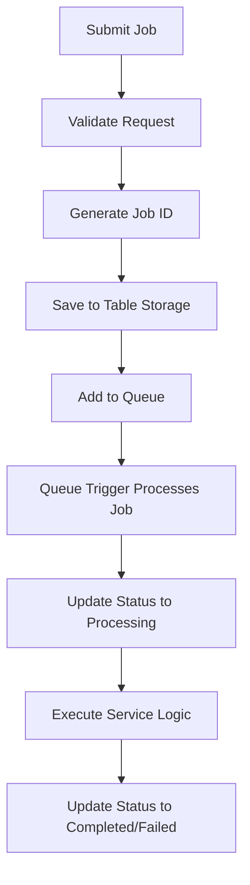

# RMH Geospatial API Testing Guide

## Overview

This document provides comprehensive testing guidelines for the RMH Geospatial API (rmhgeoapi), an Azure Functions-based ETL pipeline for geospatial data processing.

## Architecture Overview

### Core Components

1. **Function App (`function_app.py`)** - Main Azure Functions endpoints
2. **Models (`models.py`)** - Data structures for job requests and status tracking
3. **Repositories (`repositories.py`)** - Data persistence layer for Azure Table Storage and Blob Storage
4. **Services (`services.py`)** - Business logic layer with processing services
5. **Constants (`constants.py`)** - Centralized configuration constants
6. **Config (`config.py`)** - Environment variable management

### Job Workflow



## API Endpoints

### 1. Job Submission
- **Endpoint**: `POST /api/jobs/{operation_type}`
- **Authentication**: Function Key or Azure AD
- **Purpose**: Submit new processing jobs

#### Parameters
- `operation_type` (path): Type of operation to perform
- Request Body:
  - `dataset_id` (string): Dataset identifier
  - `resource_id` (string): Resource identifier  
  - `version_id` (string): Version identifier
  - `system` (boolean, optional): System vs DDH operation flag

#### Response
```json
{
  "job_id": "3d60e592b63f9b4d797b48830952605fde3d31c0a839cda17020c2f4cc673a8b",
  "status": "queued",
  "message": "Job created and queued for processing",
  "is_duplicate": false,
  "dataset_id": "test-dataset-001",
  "resource_id": "resource-123",
  "version_id": "v1.0.0",
  "operation_type": "hello_world",
  "system": false
}
```

### 2. Job Status Check
- **Endpoint**: `GET /api/jobs/{job_id}`
- **Authentication**: Function Key or Azure AD
- **Purpose**: Check job status and results

#### Response
```json
{
  "job_id": "3d60e592b63f9b4d797b48830952605fde3d31c0a839cda17020c2f4cc673a8b",
  "dataset_id": "test-dataset-001",
  "resource_id": "resource-123", 
  "version_id": "v1.0.0",
  "operation_type": "hello_world",
  "system": false,
  "status": "completed",
  "created_at": "2025-08-15T21:47:56.280856+00:00",
  "updated_at": "2025-08-15T21:47:58.533551+00:00",
  "error_message": null,
  "result_data": {...},
  "request_parameters": {...}
}
```

### 3. Manual Job Processing
- **Endpoint**: `POST /api/jobs/{job_id}/process`
- **Authentication**: Function Key or Azure AD
- **Purpose**: Manually trigger job processing (debugging)

## Job States

- **`pending`**: Job created but not yet queued
- **`queued`**: Job added to processing queue
- **`processing`**: Job currently being processed
- **`completed`**: Job finished successfully
- **`failed`**: Job encountered an error

## Supported Operations

### 1. Hello World (`hello_world`)
- **Purpose**: Test operation that validates the pipeline
- **Requirements**: All ETL parameters (dataset_id, resource_id, version_id)
- **Output**: Formatted parameter display and success confirmation

### 2. List Container (`list_container`)
- **Purpose**: List contents of Azure Storage containers
- **Usage**:
  - `dataset_id`: Container name to list
  - `resource_id`: Prefix filter (use "none" for no filter)
  - `version_id`: Not used
- **Output**: Container contents with file details and statistics

### 3. STAC Operations (`stac_*`)
- **Purpose**: STAC (SpatioTemporal Asset Catalog) operations
- **Service**: Routes to `STACService` in `stac_service.py`

## Job ID Generation

Jobs use deterministic SHA256 hashing for idempotency:
```python
content = f"{operation_type}:{dataset_id}:{resource_id}:{version_id}:{system}"
job_id = hashlib.sha256(content.encode()).hexdigest()
```

## Authentication Methods

### 1. Function Key Authentication
```bash
curl -X POST "https://rmhgeoapi-akdsa0fwd3hahtgx.eastus-01.azurewebsites.net/api/jobs/hello_world?code=YOUR_FUNCTION_KEY" \
  -H "Content-Type: application/json" \
  -d '{"dataset_id": "test", "resource_id": "test", "version_id": "v1.0.0"}'
```

### 2. Azure AD Authentication
```bash
curl -X POST "https://rmhgeoapi-akdsa0fwd3hahtgx.eastus-01.azurewebsites.net/api/jobs/hello_world" \
  -H "Authorization: Bearer YOUR_AZURE_AD_TOKEN" \
  -H "Content-Type: application/json" \
  -d '{"dataset_id": "test", "resource_id": "test", "version_id": "v1.0.0"}'
```

## Testing Scripts

### Production API Tests

#### 1. Function Key Test (`test_with_function_key.py`)
```bash
python test_with_function_key.py
# Prompts for function key interactively
```

#### 2. Azure AD Test (`test_production_api.py`)
```bash
python test_production_api.py
# Prompts for Azure AD authentication choice
```

#### 3. Simple HTTP Test
```python
import requests
import json

BASE_URL = "https://rmhgeoapi-akdsa0fwd3hahtgx.eastus-01.azurewebsites.net/api"
FUNCTION_KEY = "YOUR_FUNCTION_KEY"

# Submit job
response = requests.post(
    f"{BASE_URL}/jobs/hello_world",
    json={
        "dataset_id": "test-dataset",
        "resource_id": "test-resource",
        "version_id": "v1.0.0"
    },
    params={"code": FUNCTION_KEY}
)

print(f"Status: {response.status_code}")
print(f"Response: {response.json()}")
```

### Local Development Tests

#### Unit Tests
```bash
# Test model validation
python -c "
from models import JobRequest
job = JobRequest('test', 'test', 'v1.0.0', 'hello_world')
print(f'Valid: {job.validate()}')
print(f'Job ID: {job.job_id}')
"

# Test constants
python test_constants_integration.py

# Test unified endpoint
python test_unified_endpoint.py
```

#### Storage Integration Tests
```bash
python test_storage_integration.py
python test_storage_repository.py
python test_container_listing.py
```

## Environment Configuration

### Required Environment Variables

#### Azure Storage
- `STORAGE_ACCOUNT_NAME`: Storage account name
- `AzureWebJobsStorage`: Connection string (local dev)
- `BRONZE_CONTAINER_NAME`: Bronze tier container
- `SILVER_CONTAINER_NAME`: Silver tier container  
- `GOLD_CONTAINER_NAME`: Gold tier container

#### PostGIS Database
- `POSTGIS_HOST`: Database host
- `POSTGIS_PORT`: Database port
- `POSTGIS_USER`: Database user
- `POSTGIS_PASSWORD`: Database password (optional with managed identity)
- `POSTGIS_DATABASE`: Database name
- `POSTGIS_SCHEMA`: Database schema

#### Application Settings
- `FUNCTION_TIMEOUT`: Function timeout (default: 300)
- `MAX_RETRY_ATTEMPTS`: Retry attempts (default: 3)
- `LOG_LEVEL`: Logging level (default: INFO)

## Testing Scenarios

### 1. Basic Job Submission
```bash
# Test basic hello_world operation
curl -X POST "${BASE_URL}/jobs/hello_world?code=${FUNCTION_KEY}" \
  -H "Content-Type: application/json" \
  -d '{
    "dataset_id": "test-dataset-001",
    "resource_id": "resource-123", 
    "version_id": "v1.0.0"
  }'
```

### 2. Container Listing
```bash
# List container contents
curl -X POST "${BASE_URL}/jobs/list_container?code=${FUNCTION_KEY}" \
  -H "Content-Type: application/json" \
  -d '{
    "dataset_id": "bronze",
    "resource_id": "data/",
    "version_id": "v1.0.0"
  }'
```

### 3. System Operations
```bash
# System operation with relaxed validation
curl -X POST "${BASE_URL}/jobs/hello_world?code=${FUNCTION_KEY}" \
  -H "Content-Type: application/json" \
  -d '{
    "dataset_id": "container-name",
    "resource_id": "prefix",
    "version_id": "any",
    "system": true
  }'
```

### 4. Idempotency Testing
```bash
# Submit same job twice - should return duplicate response
curl -X POST "${BASE_URL}/jobs/hello_world?code=${FUNCTION_KEY}" \
  -H "Content-Type: application/json" \
  -d '{
    "dataset_id": "test-idempotency",
    "resource_id": "test",
    "version_id": "v1.0.0"
  }'

# Second request returns is_duplicate: true
```

### 5. Error Handling
```bash
# Missing required parameters
curl -X POST "${BASE_URL}/jobs/hello_world?code=${FUNCTION_KEY}" \
  -H "Content-Type: application/json" \
  -d '{
    "dataset_id": "test"
  }'
# Expected: 400 Bad Request

# Invalid operation type
curl -X POST "${BASE_URL}/jobs/invalid_operation?code=${FUNCTION_KEY}" \
  -H "Content-Type: application/json" \
  -d '{
    "dataset_id": "test",
    "resource_id": "test",
    "version_id": "v1.0.0"
  }'
# Processed by HelloWorldService (fallback)
```

## Monitoring and Debugging

### Job Status Monitoring
```bash
# Check job status
JOB_ID="your_job_id_here"
curl "${BASE_URL}/jobs/${JOB_ID}?code=${FUNCTION_KEY}"

# Monitor job progression
while true; do
  STATUS=$(curl -s "${BASE_URL}/jobs/${JOB_ID}?code=${FUNCTION_KEY}" | jq -r '.status')
  echo "Job status: $STATUS"
  [[ "$STATUS" == "completed" || "$STATUS" == "failed" ]] && break
  sleep 2
done
```

### Manual Job Processing
```bash
# Manually trigger job processing (for debugging)
curl -X POST "${BASE_URL}/jobs/${JOB_ID}/process?code=${FUNCTION_KEY}"
```

### Configuration Debugging
```python
from config import Config
print(Config.debug_config())
```

## Performance Testing

### Load Testing
```python
import concurrent.futures
import requests
import time

def submit_job(i):
    response = requests.post(
        f"{BASE_URL}/jobs/hello_world",
        json={
            "dataset_id": f"load-test-{i}",
            "resource_id": "test",
            "version_id": "v1.0.0"
        },
        params={"code": FUNCTION_KEY}
    )
    return response.status_code, response.json()

# Submit 10 concurrent jobs
with concurrent.futures.ThreadPoolExecutor(max_workers=10) as executor:
    futures = [executor.submit(submit_job, i) for i in range(10)]
    results = [future.result() for future in futures]

for i, (status, data) in enumerate(results):
    print(f"Job {i}: {status} - {data.get('job_id', 'Error')}")
```

## Common Issues and Solutions

### 1. 401 Unauthorized
- **Cause**: Missing or invalid function key/Azure AD token
- **Solution**: Verify authentication credentials

### 2. Job Stuck in "queued" Status
- **Cause**: Queue processing issues or function app scaling
- **Solution**: Use manual processing endpoint or check Azure Function logs

### 3. Storage Access Errors
- **Cause**: Missing storage configuration or permissions
- **Solution**: Verify environment variables and managed identity permissions

### 4. Validation Errors
- **Cause**: Missing required parameters for DDH operations
- **Solution**: Ensure all ETL parameters are provided for system=false operations

## Production Deployment Information

- **Function App**: `rmhgeoapi-akdsa0fwd3hahtgx.eastus-01.azurewebsites.net`
- **Resource Group**: `rmhazure_rg`
- **Runtime**: Python 3.12
- **Plan**: Flex Consumption
- **Region**: East US

## Testing Checklist

### Pre-deployment Testing
- [ ] Unit tests for models and validation
- [ ] Storage integration tests
- [ ] Service logic tests
- [ ] Configuration validation tests

### Post-deployment Testing
- [ ] Basic job submission
- [ ] Job status retrieval
- [ ] Idempotency verification
- [ ] Error handling validation
- [ ] Authentication methods
- [ ] Queue processing verification
- [ ] Manual processing endpoint

### Performance Testing
- [ ] Load testing with concurrent requests
- [ ] Large payload handling
- [ ] Queue processing under load
- [ ] Memory and timeout testing

### Security Testing
- [ ] Authentication bypass attempts
- [ ] Input validation and injection testing
- [ ] Function key rotation testing
- [ ] Azure AD token validation

---

## Quick Test Commands

### Test Live Function (Current)
```bash
python -c "
import requests
import json

BASE_URL = 'https://rmhgeoapi-akdsa0fwd3hahtgx.eastus-01.azurewebsites.net/api'
FUNCTION_KEY = 'XBQzu2hA7sprVAvfA9UN0FPD4yrD3c3tANMNCdZqeOqZAzFuNElLEA=='

response = requests.post(
    f'{BASE_URL}/jobs/hello_world',
    json={'dataset_id': 'test', 'resource_id': 'test', 'version_id': 'v1.0.0'},
    params={'code': FUNCTION_KEY}
)

print(f'Status: {response.status_code}')
print(f'Response: {response.text}')
"
```

This documentation provides future Claude instances with complete context for testing the RMH Geospatial API effectively.