# Architecture Diagrams

**Last Updated**: 02 FEB 2026
**Format**: Mermaid (renders in GitHub/VS Code)
**Model**: C4 Architecture (Context → Container → Component → Code)

---

## Table of Contents

1. [System Context (C1)](#1-system-context-c1)
2. [Platform → Queue → CoreMachine](#2-platform--queue--coremachine) ⭐ **Critical**
3. [Container View (C3)](#3-container-view-c3)
4. [Core Orchestration (C4)](#4-core-orchestration-c4) ⭐ Primary
5. [State Machines](#5-state-machines) ⭐ Primary
6. [Job Execution Sequences](#6-job-execution-sequences)
7. [Data Flow](#7-data-flow)
8. [Registry Architecture](#8-registry-architecture)

---

## 1. System Context (C1)

High-level view showing external actors and system boundaries.

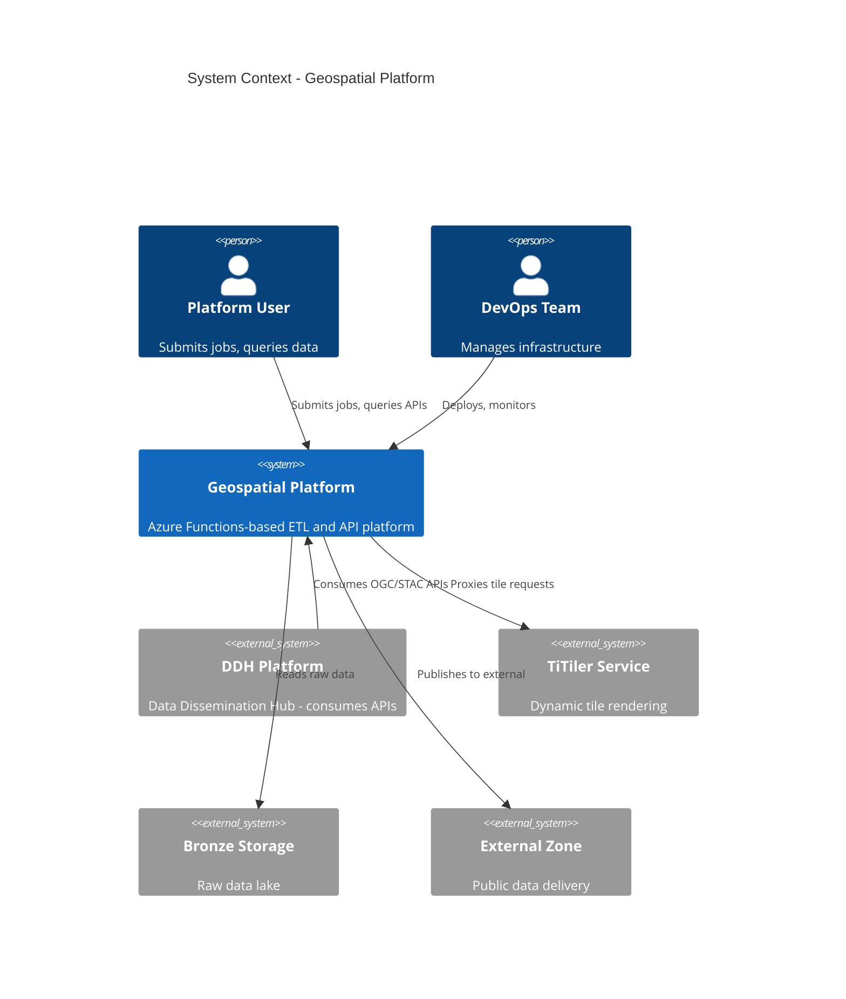
```mermaid
C4Context
    title System Context - Geospatial Platform

    Person(user, "Platform User", "Submits jobs, queries data")
    Person(devops, "DevOps Team", "Manages infrastructure")

    System(geoplatform, "Geospatial Platform", "Azure Functions-based ETL and API platform")

    System_Ext(ddh, "DDH Platform", "Data Dissemination Hub - consumes APIs")
    System_Ext(titiler, "TiTiler Service", "Dynamic tile rendering")
    System_Ext(bronze, "Bronze Storage", "Raw data lake")
    System_Ext(external, "External Zone", "Public data delivery")

    Rel(user, geoplatform, "Submits jobs, queries APIs")
    Rel(devops, geoplatform, "Deploys, monitors")
    Rel(ddh, geoplatform, "Consumes OGC/STAC APIs")
    Rel(geoplatform, titiler, "Proxies tile requests")
    Rel(geoplatform, bronze, "Reads raw data")
    Rel(geoplatform, external, "Publishes to external")
```

### Simplified Context (Standard Flowchart)

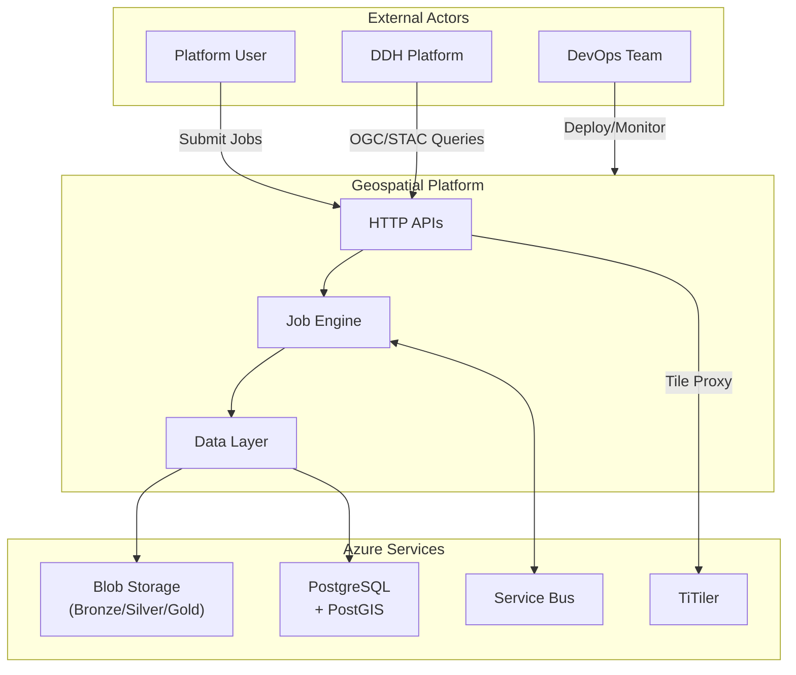
```mermaid
flowchart TB
    subgraph External["External Actors"]
        User["Platform User"]
        DDH["DDH Platform"]
        DevOps["DevOps Team"]
    end

    subgraph Platform["Geospatial Platform"]
        API["HTTP APIs"]
        Jobs["Job Engine"]
        Data["Data Layer"]
    end

    subgraph Azure["Azure Services"]
        Blob["Blob Storage<br/>(Bronze/Silver/Gold)"]
        PG["PostgreSQL<br/>+ PostGIS"]
        SB["Service Bus"]
        TT["TiTiler"]
    end

    User -->|"Submit Jobs"| API
    DDH -->|"OGC/STAC Queries"| API
    DevOps -->|"Deploy/Monitor"| Platform

    API --> Jobs
    Jobs --> Data
    Data --> Blob
    Data --> PG
    Jobs <--> SB
    API -->|"Tile Proxy"| TT
```

---

## 2. Platform → Queue → CoreMachine

**This is the fundamental decoupling pattern.** The queue is the contract boundary.

### 2.1 The Queue Contract (Critical)

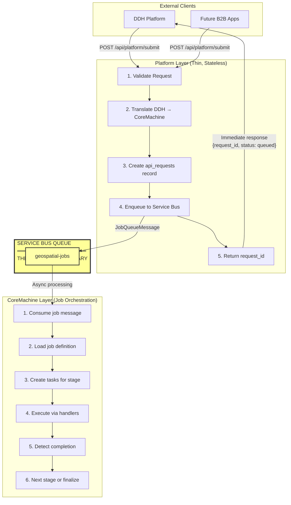
```mermaid
flowchart TB
    subgraph External["External Clients"]
        DDH["DDH Platform"]
        Future["Future B2B Apps"]
    end

    subgraph Platform["Platform Layer (Thin, Stateless)"]
        Validate["1. Validate Request"]
        Translate["2. Translate DDH → CoreMachine"]
        Track["3. Create api_requests record"]
        Enqueue["4. Enqueue to Service Bus"]
        Return["5. Return request_id"]

        Validate --> Translate --> Track --> Enqueue --> Return
    end

    subgraph Queue["SERVICE BUS QUEUE<br/>═══════════════════<br/>THE CONTRACT BOUNDARY"]
        JobsQ["geospatial-jobs"]
    end

    subgraph CoreMachine["CoreMachine Layer (Job Orchestration)"]
        Consume["1. Consume job message"]
        LoadJob["2. Load job definition"]
        CreateTasks["3. Create tasks for stage"]
        Execute["4. Execute via handlers"]
        Complete["5. Detect completion"]
        Advance["6. Next stage or finalize"]

        Consume --> LoadJob --> CreateTasks --> Execute --> Complete --> Advance
    end

    DDH -->|"POST /api/platform/submit"| Validate
    Future -->|"POST /api/platform/submit"| Validate
    Return -->|"Immediate response<br/>{request_id, status: queued}"| DDH

    Enqueue -->|"JobQueueMessage"| JobsQ
    JobsQ -->|"Async processing"| Consume

    style Queue fill:#ff9,stroke:#333,stroke-width:3px
    style JobsQ fill:#ffa,stroke:#333,stroke-width:2px
```

### 2.2 What Each Layer Knows

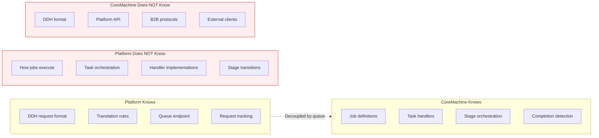
```mermaid
flowchart LR
    subgraph PlatformKnows["Platform Knows"]
        P1["DDH request format"]
        P2["Translation rules"]
        P3["Queue endpoint"]
        P4["Request tracking"]
    end

    subgraph PlatformIgnores["Platform Does NOT Know"]
        PI1["How jobs execute"]
        PI2["Task orchestration"]
        PI3["Handler implementations"]
        PI4["Stage transitions"]
    end

    subgraph CoreKnows["CoreMachine Knows"]
        C1["Job definitions"]
        C2["Task handlers"]
        C3["Stage orchestration"]
        C4["Completion detection"]
    end

    subgraph CoreIgnores["CoreMachine Does NOT Know"]
        CI1["DDH format"]
        CI2["Platform API"]
        CI3["B2B protocols"]
        CI4["External clients"]
    end

    PlatformKnows -.->|"Decoupled by queue"| CoreKnows

    style PlatformIgnores fill:#fee,stroke:#c00
    style CoreIgnores fill:#fee,stroke:#c00
```

### 2.3 Sequence: Platform Submit Flow

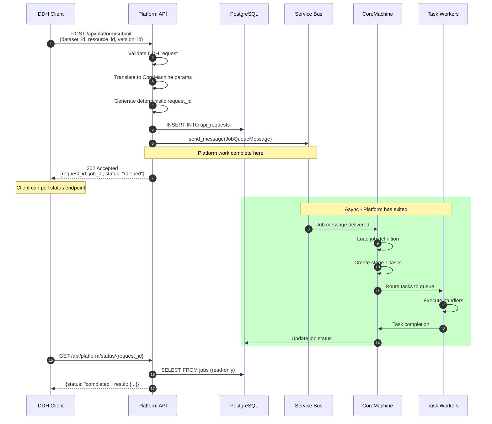
```mermaid
sequenceDiagram
    autonumber
    participant DDH as DDH Client
    participant Platform as Platform API
    participant DB as PostgreSQL
    participant SB as Service Bus
    participant CM as CoreMachine
    participant Worker as Task Workers

    DDH->>Platform: POST /api/platform/submit<br/>{dataset_id, resource_id, version_id}

    Platform->>Platform: Validate DDH request
    Platform->>Platform: Translate to CoreMachine params
    Platform->>Platform: Generate deterministic request_id
    Platform->>DB: INSERT INTO api_requests
    Platform->>SB: send_message(JobQueueMessage)

    Note over Platform,SB: Platform work complete here

    Platform-->>DDH: 202 Accepted<br/>{request_id, job_id, status: "queued"}

    Note over DDH: Client can poll status endpoint

    rect rgb(200, 255, 200)
        Note over SB,Worker: Async - Platform has exited
        SB->>CM: Job message delivered
        CM->>CM: Load job definition
        CM->>CM: Create stage 1 tasks
        CM->>Worker: Route tasks to queue
        Worker->>Worker: Execute handlers
        Worker->>CM: Task completion
        CM->>DB: Update job status
    end

    DDH->>Platform: GET /api/platform/status/{request_id}
    Platform->>DB: SELECT FROM jobs (read-only)
    Platform-->>DDH: {status: "completed", result: {...}}
```

### 2.4 Migration Implication

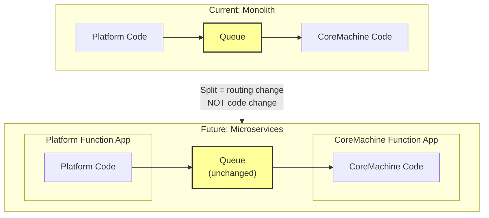
```mermaid
flowchart TB
    subgraph Current["Current: Monolith"]
        M_Platform["Platform Code"]
        M_Queue["Queue"]
        M_Core["CoreMachine Code"]

        M_Platform --> M_Queue --> M_Core
    end

    subgraph Future["Future: Microservices"]
        subgraph App1["Platform Function App"]
            F_Platform["Platform Code"]
        end

        F_Queue["Queue<br/>(unchanged)"]

        subgraph App2["CoreMachine Function App"]
            F_Core["CoreMachine Code"]
        end

        F_Platform --> F_Queue --> F_Core
    end

    Current -.->|"Split = routing change<br/>NOT code change"| Future

    style F_Queue fill:#ff9,stroke:#333,stroke-width:2px
    style M_Queue fill:#ff9,stroke:#333,stroke-width:2px
```

**Key Insight**: Because the queue is the contract, splitting to microservices requires:
- Moving code to separate repos/apps
- Updating APIM routing
- NO changes to Platform or CoreMachine logic

---

## 3. Container View (C3)

Deployable units and their interactions.

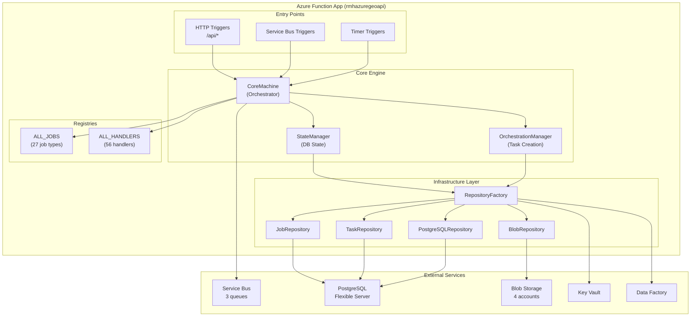
```mermaid
flowchart TB
    subgraph FunctionApp["Azure Function App (rmhazuregeoapi)"]
        subgraph Triggers["Entry Points"]
            HTTP["HTTP Triggers<br/>/api/*"]
            SBTrigger["Service Bus Triggers"]
            Timer["Timer Triggers"]
        end

        subgraph Core["Core Engine"]
            CM["CoreMachine<br/>(Orchestrator)"]
            SM["StateManager<br/>(DB State)"]
            OM["OrchestrationManager<br/>(Task Creation)"]
        end

        subgraph Registries["Registries"]
            AllJobs["ALL_JOBS<br/>(27 job types)"]
            AllHandlers["ALL_HANDLERS<br/>(56 handlers)"]
        end

        subgraph Infra["Infrastructure Layer"]
            RepoFactory["RepositoryFactory"]
            JobRepo["JobRepository"]
            TaskRepo["TaskRepository"]
            BlobRepo["BlobRepository"]
            PGRepo["PostgreSQLRepository"]
        end
    end

    subgraph External["External Services"]
        SB["Service Bus<br/>3 queues"]
        PG["PostgreSQL<br/>Flexible Server"]
        Blob["Blob Storage<br/>4 accounts"]
        KV["Key Vault"]
        ADF["Data Factory"]
    end

    HTTP --> CM
    SBTrigger --> CM
    Timer --> CM

    CM --> SM
    CM --> OM
    CM --> AllJobs
    CM --> AllHandlers

    SM --> RepoFactory
    OM --> RepoFactory

    RepoFactory --> JobRepo
    RepoFactory --> TaskRepo
    RepoFactory --> BlobRepo
    RepoFactory --> PGRepo

    JobRepo --> PG
    TaskRepo --> PG
    BlobRepo --> Blob
    PGRepo --> PG
    CM --> SB
    RepoFactory --> KV
    RepoFactory --> ADF
```

---

## 4. Core Orchestration (C4)

**This is the heart of the system** - the CoreMachine and its composition pattern.

### 3.1 CoreMachine Composition

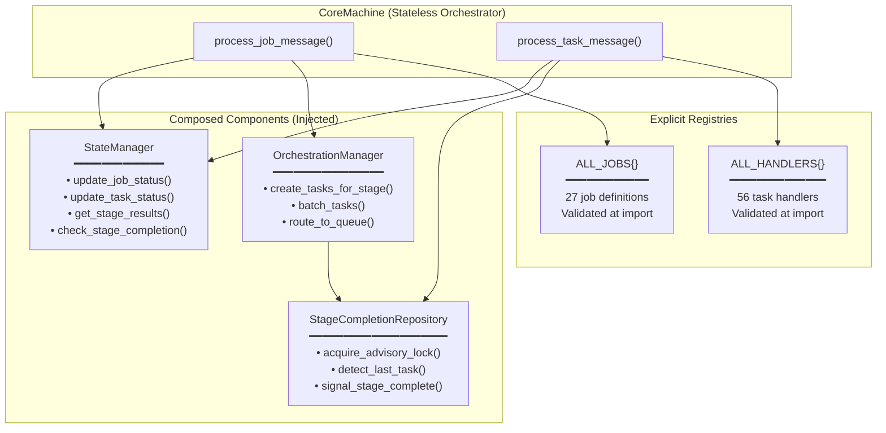
```mermaid
flowchart TB
    subgraph CoreMachine["CoreMachine (Stateless Orchestrator)"]
        direction TB
        PJM["process_job_message()"]
        PTM["process_task_message()"]
    end

    subgraph Composed["Composed Components (Injected)"]
        SM["StateManager<br/>━━━━━━━━━━━━━<br/>• update_job_status()<br/>• update_task_status()<br/>• get_stage_results()<br/>• check_stage_completion()"]

        OM["OrchestrationManager<br/>━━━━━━━━━━━━━━━━<br/>• create_tasks_for_stage()<br/>• batch_tasks()<br/>• route_to_queue()"]

        SCR["StageCompletionRepository<br/>━━━━━━━━━━━━━━━━━━━━<br/>• acquire_advisory_lock()<br/>• detect_last_task()<br/>• signal_stage_complete()"]
    end

    subgraph Registries["Explicit Registries"]
        AJ["ALL_JOBS{}<br/>━━━━━━━━━━━━<br/>27 job definitions<br/>Validated at import"]

        AH["ALL_HANDLERS{}<br/>━━━━━━━━━━━━━━<br/>56 task handlers<br/>Validated at import"]
    end

    PJM --> SM
    PJM --> OM
    PJM --> AJ

    PTM --> SM
    PTM --> SCR
    PTM --> AH

    OM --> SCR
```

### 3.2 CoreMachine Internal Flow

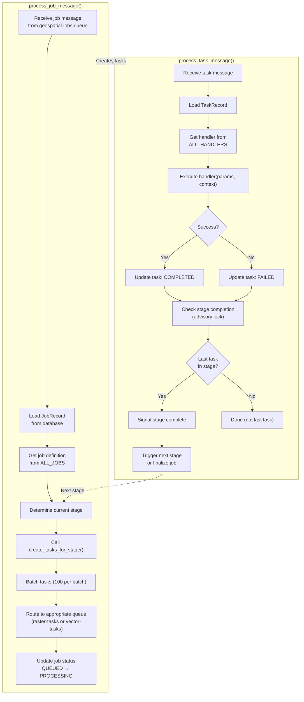
```mermaid
flowchart TD
    subgraph JobProcessing["process_job_message()"]
        J1["Receive job message<br/>from geospatial-jobs queue"]
        J2["Load JobRecord<br/>from database"]
        J3["Get job definition<br/>from ALL_JOBS"]
        J4["Determine current stage"]
        J5["Call create_tasks_for_stage()"]
        J6["Batch tasks (100 per batch)"]
        J7["Route to appropriate queue<br/>(raster-tasks or vector-tasks)"]
        J8["Update job status<br/>QUEUED → PROCESSING"]

        J1 --> J2 --> J3 --> J4 --> J5 --> J6 --> J7 --> J8
    end

    subgraph TaskProcessing["process_task_message()"]
        T1["Receive task message"]
        T2["Load TaskRecord"]
        T3["Get handler from<br/>ALL_HANDLERS"]
        T4["Execute handler(params, context)"]
        T5{"Success?"}
        T6["Update task: COMPLETED"]
        T7["Update task: FAILED"]
        T8["Check stage completion<br/>(advisory lock)"]
        T9{"Last task<br/>in stage?"}
        T10["Signal stage complete"]
        T11["Trigger next stage<br/>or finalize job"]
        T12["Done (not last task)"]

        T1 --> T2 --> T3 --> T4 --> T5
        T5 -->|Yes| T6 --> T8
        T5 -->|No| T7 --> T8
        T8 --> T9
        T9 -->|Yes| T10 --> T11
        T9 -->|No| T12
    end

    JobProcessing -.->|"Creates tasks"| TaskProcessing
    T11 -.->|"Next stage"| J4
```

### 3.3 "Last Task Turns Out the Lights" Pattern

This is the critical concurrency pattern using PostgreSQL advisory locks.

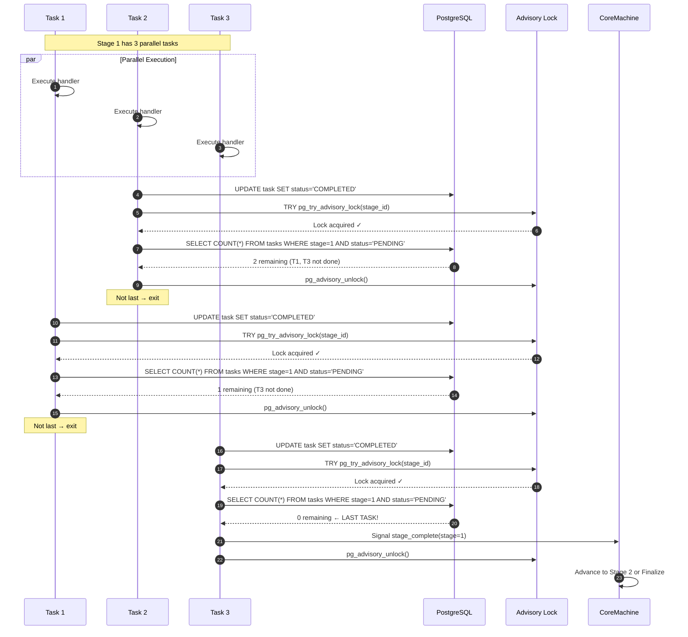
```mermaid
sequenceDiagram
    autonumber
    participant T1 as Task 1
    participant T2 as Task 2
    participant T3 as Task 3
    participant DB as PostgreSQL
    participant Lock as Advisory Lock
    participant CM as CoreMachine

    Note over T1,T3: Stage 1 has 3 parallel tasks

    par Parallel Execution
        T1->>T1: Execute handler
        T2->>T2: Execute handler
        T3->>T3: Execute handler
    end

    T2->>DB: UPDATE task SET status='COMPLETED'
    T2->>Lock: TRY pg_try_advisory_lock(stage_id)
    Lock-->>T2: Lock acquired ✓
    T2->>DB: SELECT COUNT(*) FROM tasks WHERE stage=1 AND status='PENDING'
    DB-->>T2: 2 remaining (T1, T3 not done)
    T2->>Lock: pg_advisory_unlock()
    Note over T2: Not last → exit

    T1->>DB: UPDATE task SET status='COMPLETED'
    T1->>Lock: TRY pg_try_advisory_lock(stage_id)
    Lock-->>T1: Lock acquired ✓
    T1->>DB: SELECT COUNT(*) FROM tasks WHERE stage=1 AND status='PENDING'
    DB-->>T1: 1 remaining (T3 not done)
    T1->>Lock: pg_advisory_unlock()
    Note over T1: Not last → exit

    T3->>DB: UPDATE task SET status='COMPLETED'
    T3->>Lock: TRY pg_try_advisory_lock(stage_id)
    Lock-->>T3: Lock acquired ✓
    T3->>DB: SELECT COUNT(*) FROM tasks WHERE stage=1 AND status='PENDING'
    DB-->>T3: 0 remaining ← LAST TASK!
    T3->>CM: Signal stage_complete(stage=1)
    T3->>Lock: pg_advisory_unlock()

    CM->>CM: Advance to Stage 2 or Finalize
```

---

## 5. State Machines

### 4.1 Job State Machine

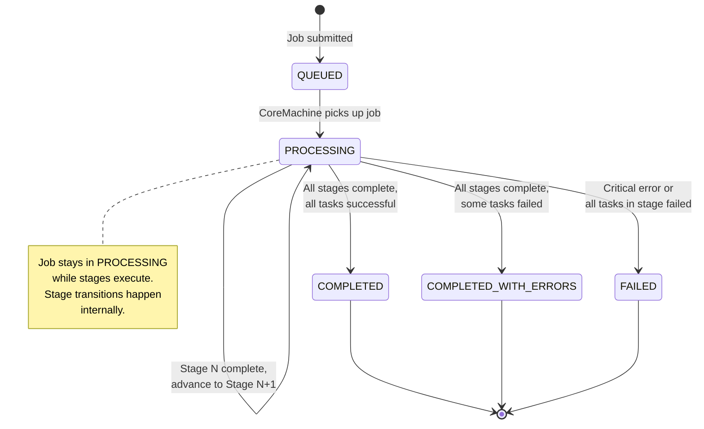
```mermaid
stateDiagram-v2
    [*] --> QUEUED: Job submitted

    QUEUED --> PROCESSING: CoreMachine picks up job

    PROCESSING --> PROCESSING: Stage N complete,<br/>advance to Stage N+1

    PROCESSING --> COMPLETED: All stages complete,<br/>all tasks successful

    PROCESSING --> COMPLETED_WITH_ERRORS: All stages complete,<br/>some tasks failed

    PROCESSING --> FAILED: Critical error or<br/>all tasks in stage failed

    COMPLETED --> [*]
    COMPLETED_WITH_ERRORS --> [*]
    FAILED --> [*]

    note right of PROCESSING
        Job stays in PROCESSING
        while stages execute.
        Stage transitions happen
        internally.
    end note
```

### 4.2 Task State Machine

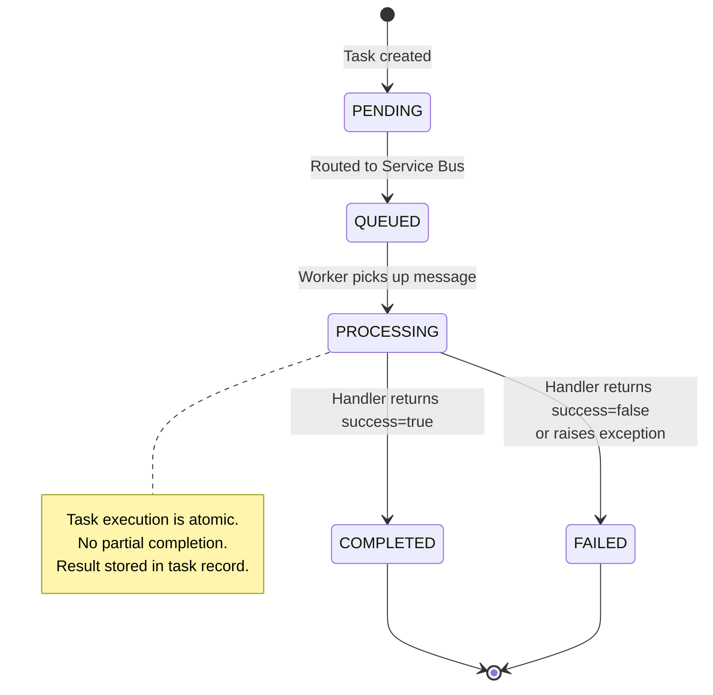
```mermaid
stateDiagram-v2
    [*] --> PENDING: Task created

    PENDING --> QUEUED: Routed to Service Bus

    QUEUED --> PROCESSING: Worker picks up message

    PROCESSING --> COMPLETED: Handler returns success=true

    PROCESSING --> FAILED: Handler returns success=false<br/>or raises exception

    COMPLETED --> [*]
    FAILED --> [*]

    note right of PROCESSING
        Task execution is atomic.
        No partial completion.
        Result stored in task record.
    end note
```

### 4.3 Stage State Machine

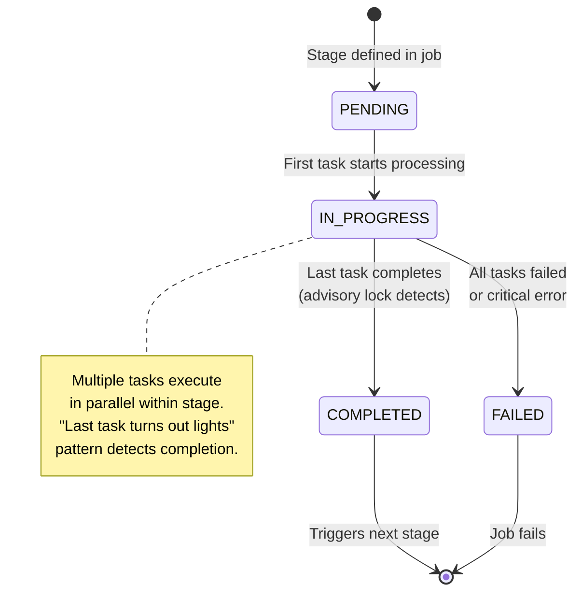
```mermaid
stateDiagram-v2
    [*] --> PENDING: Stage defined in job

    PENDING --> IN_PROGRESS: First task starts processing

    IN_PROGRESS --> COMPLETED: Last task completes<br/>(advisory lock detects)

    IN_PROGRESS --> FAILED: All tasks failed<br/>or critical error

    COMPLETED --> [*]: Triggers next stage
    FAILED --> [*]: Job fails

    note right of IN_PROGRESS
        Multiple tasks execute
        in parallel within stage.
        "Last task turns out lights"
        pattern detects completion.
    end note
```

### 4.4 Combined State Flow

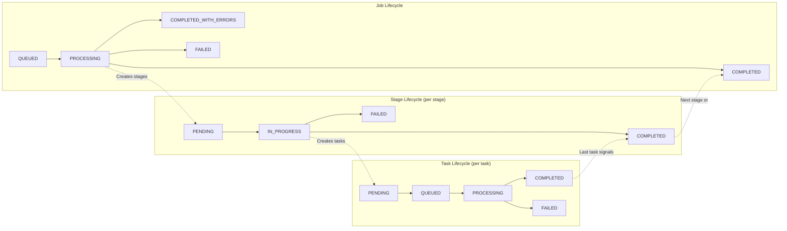
```mermaid
flowchart LR
    subgraph Job["Job Lifecycle"]
        JQ["QUEUED"] --> JP["PROCESSING"]
        JP --> JC["COMPLETED"]
        JP --> JE["COMPLETED_WITH_ERRORS"]
        JP --> JF["FAILED"]
    end

    subgraph Stage["Stage Lifecycle (per stage)"]
        SP["PENDING"] --> SI["IN_PROGRESS"]
        SI --> SC["COMPLETED"]
        SI --> SF["FAILED"]
    end

    subgraph Task["Task Lifecycle (per task)"]
        TP["PENDING"] --> TQ["QUEUED"]
        TQ --> TI["PROCESSING"]
        TI --> TC["COMPLETED"]
        TI --> TF["FAILED"]
    end

    JP -.->|"Creates stages"| SP
    SI -.->|"Creates tasks"| TP
    SC -.->|"Next stage or"| JC
    TC -.->|"Last task signals"| SC
```

---

## 6. Job Execution Sequences

### 5.1 Complete Job Lifecycle

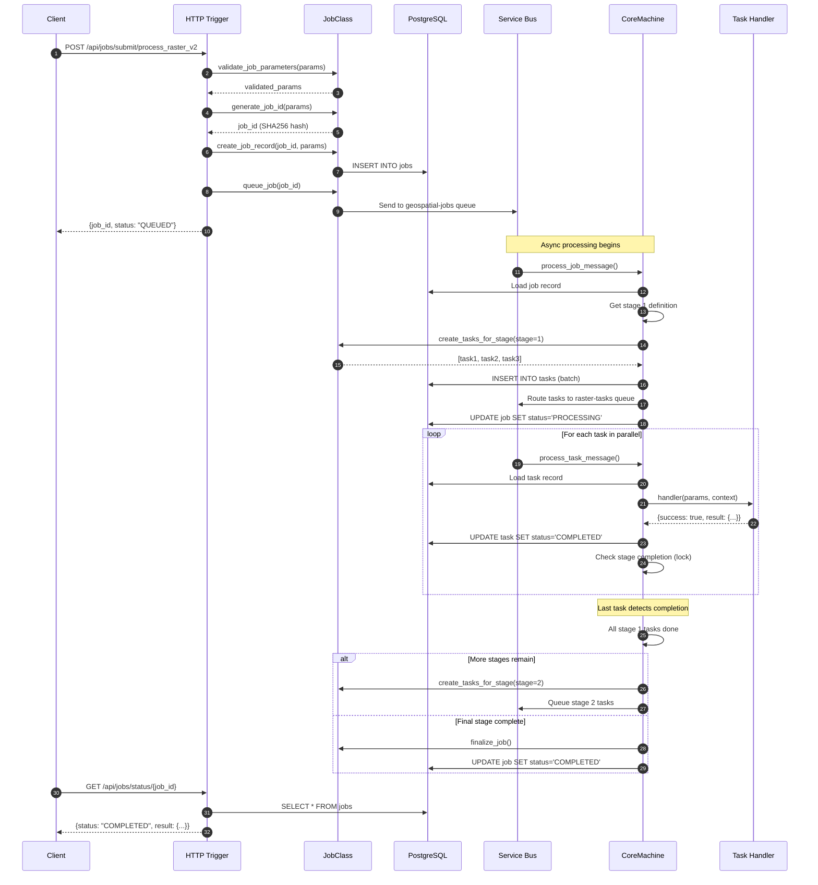
```mermaid
sequenceDiagram
    autonumber
    participant Client
    participant HTTP as HTTP Trigger
    participant Job as JobClass
    participant DB as PostgreSQL
    participant SB as Service Bus
    participant CM as CoreMachine
    participant Handler as Task Handler

    Client->>HTTP: POST /api/jobs/submit/process_raster_v2
    HTTP->>Job: validate_job_parameters(params)
    Job-->>HTTP: validated_params
    HTTP->>Job: generate_job_id(params)
    Job-->>HTTP: job_id (SHA256 hash)
    HTTP->>Job: create_job_record(job_id, params)
    Job->>DB: INSERT INTO jobs
    HTTP->>Job: queue_job(job_id)
    Job->>SB: Send to geospatial-jobs queue
    HTTP-->>Client: {job_id, status: "QUEUED"}

    Note over SB,CM: Async processing begins

    SB->>CM: process_job_message()
    CM->>DB: Load job record
    CM->>CM: Get stage 1 definition
    CM->>Job: create_tasks_for_stage(stage=1)
    Job-->>CM: [task1, task2, task3]
    CM->>DB: INSERT INTO tasks (batch)
    CM->>SB: Route tasks to raster-tasks queue
    CM->>DB: UPDATE job SET status='PROCESSING'

    loop For each task in parallel
        SB->>CM: process_task_message()
        CM->>DB: Load task record
        CM->>Handler: handler(params, context)
        Handler-->>CM: {success: true, result: {...}}
        CM->>DB: UPDATE task SET status='COMPLETED'
        CM->>CM: Check stage completion (lock)
    end

    Note over CM: Last task detects completion

    CM->>CM: All stage 1 tasks done

    alt More stages remain
        CM->>Job: create_tasks_for_stage(stage=2)
        CM->>SB: Queue stage 2 tasks
    else Final stage complete
        CM->>Job: finalize_job()
        CM->>DB: UPDATE job SET status='COMPLETED'
    end

    Client->>HTTP: GET /api/jobs/status/{job_id}
    HTTP->>DB: SELECT * FROM jobs
    HTTP-->>Client: {status: "COMPLETED", result: {...}}
```

### 5.2 Multi-Stage Job Flow (Fathom Example)

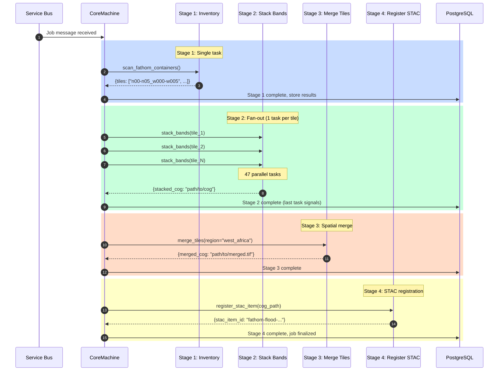
```mermaid
sequenceDiagram
    autonumber
    participant SB as Service Bus
    participant CM as CoreMachine
    participant S1 as Stage 1: Inventory
    participant S2 as Stage 2: Stack Bands
    participant S3 as Stage 3: Merge Tiles
    participant S4 as Stage 4: Register STAC
    participant DB as PostgreSQL

    SB->>CM: Job message received

    rect rgb(200, 220, 255)
        Note over S1: Stage 1: Single task
        CM->>S1: scan_fathom_containers()
        S1-->>CM: {tiles: ["n00-n05_w000-w005", ...]}
        CM->>DB: Stage 1 complete, store results
    end

    rect rgb(200, 255, 220)
        Note over S2: Stage 2: Fan-out (1 task per tile)
        CM->>S2: stack_bands(tile_1)
        CM->>S2: stack_bands(tile_2)
        CM->>S2: stack_bands(tile_N)
        Note over S2: 47 parallel tasks
        S2-->>CM: {stacked_cog: "path/to/cog"}
        CM->>DB: Stage 2 complete (last task signals)
    end

    rect rgb(255, 220, 200)
        Note over S3: Stage 3: Spatial merge
        CM->>S3: merge_tiles(region="west_africa")
        S3-->>CM: {merged_cog: "path/to/merged.tif"}
        CM->>DB: Stage 3 complete
    end

    rect rgb(255, 255, 200)
        Note over S4: Stage 4: STAC registration
        CM->>S4: register_stac_item(cog_path)
        S4-->>CM: {stac_item_id: "fathom-flood-..."}
        CM->>DB: Stage 4 complete, job finalized
    end
```

---

## 7. Data Flow

### 6.1 Storage Tier Flow

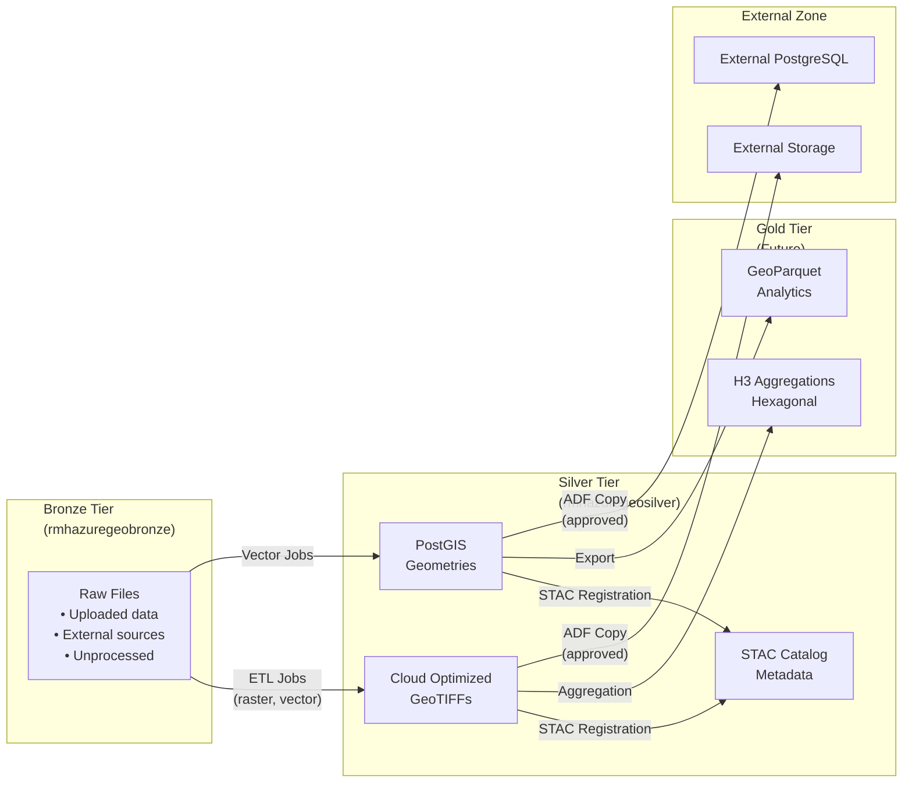
```mermaid
flowchart LR
    subgraph Bronze["Bronze Tier<br/>(rmhazuregeobronze)"]
        Raw["Raw Files<br/>• Uploaded data<br/>• External sources<br/>• Unprocessed"]
    end

    subgraph Silver["Silver Tier<br/>(rmhazuregeosilver)"]
        COG["Cloud Optimized<br/>GeoTIFFs"]
        PG["PostGIS<br/>Geometries"]
        STAC["STAC Catalog<br/>Metadata"]
    end

    subgraph Gold["Gold Tier<br/>(Future)"]
        Parquet["GeoParquet<br/>Analytics"]
        H3Agg["H3 Aggregations<br/>Hexagonal"]
    end

    subgraph External["External Zone"]
        ExtBlob["External Storage"]
        ExtPG["External PostgreSQL"]
    end

    Raw -->|"ETL Jobs<br/>(raster, vector)"| COG
    Raw -->|"Vector Jobs"| PG
    COG -->|"STAC Registration"| STAC
    PG -->|"STAC Registration"| STAC

    COG -->|"Aggregation"| H3Agg
    PG -->|"Export"| Parquet

    COG -->|"ADF Copy<br/>(approved)"| ExtBlob
    PG -->|"ADF Copy<br/>(approved)"| ExtPG
```

### 6.2 Database Schema Relationships

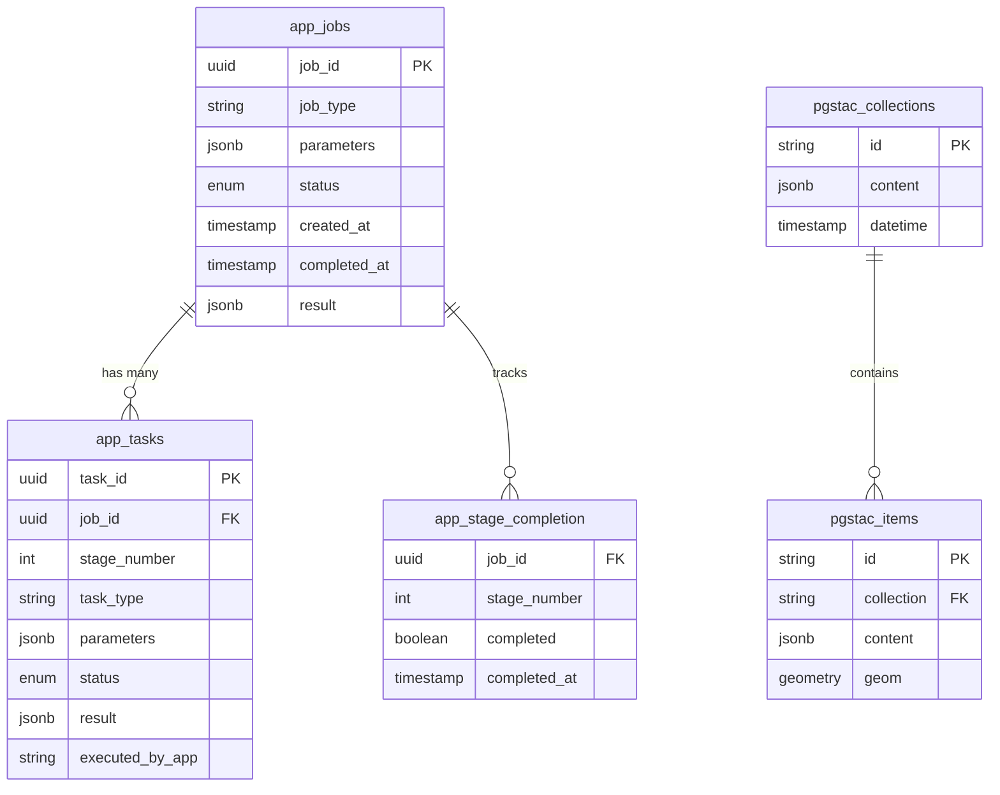
```mermaid
erDiagram
    app_jobs ||--o{ app_tasks : "has many"
    app_jobs ||--o{ app_stage_completion : "tracks"

    app_jobs {
        uuid job_id PK
        string job_type
        jsonb parameters
        enum status
        timestamp created_at
        timestamp completed_at
        jsonb result
    }

    app_tasks {
        uuid task_id PK
        uuid job_id FK
        int stage_number
        string task_type
        jsonb parameters
        enum status
        jsonb result
        string executed_by_app
    }

    app_stage_completion {
        uuid job_id FK
        int stage_number
        boolean completed
        timestamp completed_at
    }

    pgstac_collections ||--o{ pgstac_items : "contains"

    pgstac_collections {
        string id PK
        jsonb content
        timestamp datetime
    }

    pgstac_items {
        string id PK
        string collection FK
        jsonb content
        geometry geom
    }
```

---

## 8. Registry Architecture

### 7.1 Job Registry Pattern

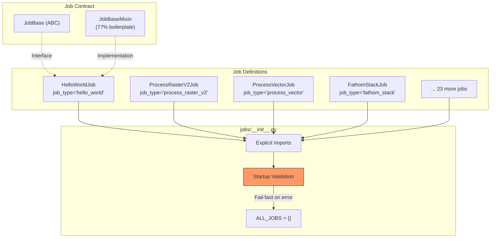
```mermaid
flowchart TB
    subgraph Registration["jobs/__init__.py"]
        Import["Explicit Imports"]
        Validate["Startup Validation"]
        Registry["ALL_JOBS = {}"]
    end

    subgraph Jobs["Job Definitions"]
        J1["HelloWorldJob<br/>job_type='hello_world'"]
        J2["ProcessRasterV2Job<br/>job_type='process_raster_v2'"]
        J3["ProcessVectorJob<br/>job_type='process_vector'"]
        J4["FathomStackJob<br/>job_type='fathom_stack'"]
        JN["... 23 more jobs"]
    end

    subgraph Base["Job Contract"]
        ABC["JobBase (ABC)"]
        Mixin["JobBaseMixin<br/>(77% boilerplate)"]
    end

    J1 --> Import
    J2 --> Import
    J3 --> Import
    J4 --> Import
    JN --> Import

    Import --> Validate
    Validate -->|"Fail-fast on error"| Registry

    ABC -.->|"Interface"| J1
    Mixin -.->|"Implementation"| J1

    style Validate fill:#f96,stroke:#333
```

### 7.2 Handler Registry Pattern

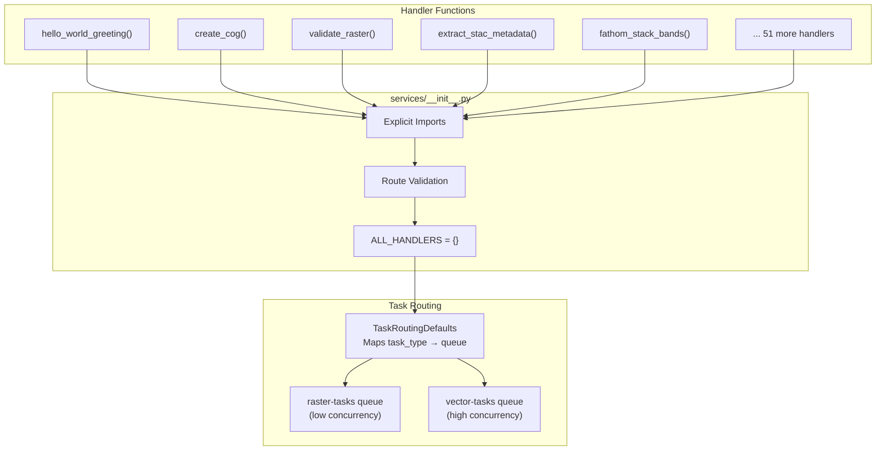
```mermaid
flowchart TB
    subgraph Registration["services/__init__.py"]
        Import["Explicit Imports"]
        Validate["Route Validation"]
        Registry["ALL_HANDLERS = {}"]
    end

    subgraph Handlers["Handler Functions"]
        H1["hello_world_greeting()"]
        H2["create_cog()"]
        H3["validate_raster()"]
        H4["extract_stac_metadata()"]
        H5["fathom_stack_bands()"]
        HN["... 51 more handlers"]
    end

    subgraph Routing["Task Routing"]
        RasterQ["raster-tasks queue<br/>(low concurrency)"]
        VectorQ["vector-tasks queue<br/>(high concurrency)"]
        Defaults["TaskRoutingDefaults<br/>Maps task_type → queue"]
    end

    H1 --> Import
    H2 --> Import
    H3 --> Import
    H4 --> Import
    H5 --> Import
    HN --> Import

    Import --> Validate
    Validate --> Registry

    Registry --> Defaults
    Defaults --> RasterQ
    Defaults --> VectorQ
```

---

## Quick Reference

### Diagram Types Used

| Diagram | Mermaid Type | Purpose |
|---------|--------------|---------|
| System Context | `flowchart` | External boundaries |
| Container View | `flowchart` | Deployable units |
| Component Detail | `flowchart` | Internal structure |
| State Machine | `stateDiagram-v2` | Lifecycle states |
| Sequence | `sequenceDiagram` | Message flow |
| ER Diagram | `erDiagram` | Database schema |

### Rendering

These diagrams render automatically in:
- GitHub markdown preview
- VS Code with Mermaid extension
- GitLab markdown
- Notion (with Mermaid block)

For local preview:
```bash
# VS Code extension
ext install bierner.markdown-mermaid

# CLI rendering
npm install -g @mermaid-js/mermaid-cli
mmdc -i ARCHITECTURE_DIAGRAMS.md -o output.pdf
```

---

## Related Documents

| Document | Purpose |
|----------|---------|
| [ARCHITECTURE_REFERENCE.md](./ARCHITECTURE_REFERENCE.md) | Detailed technical specs |
| [JOB_CREATION_QUICKSTART.md](./JOB_CREATION_QUICKSTART.md) | Creating new jobs |
| [EPICS.md](/EPICS.md) | SAFe planning structure |
